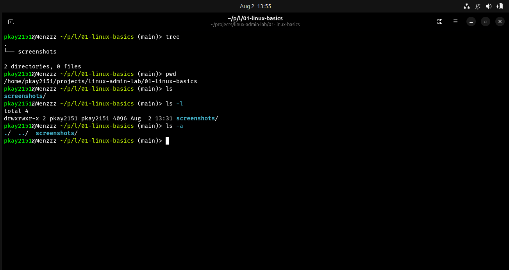
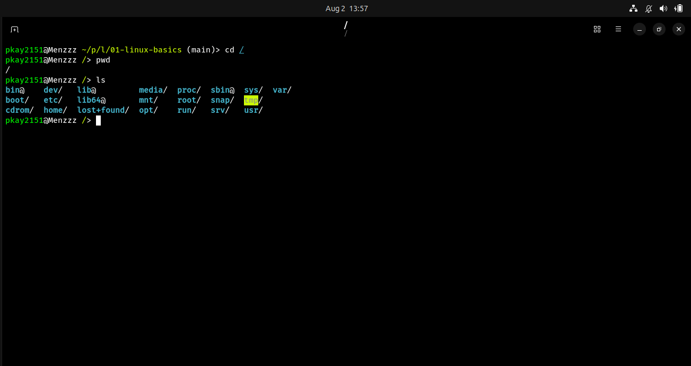
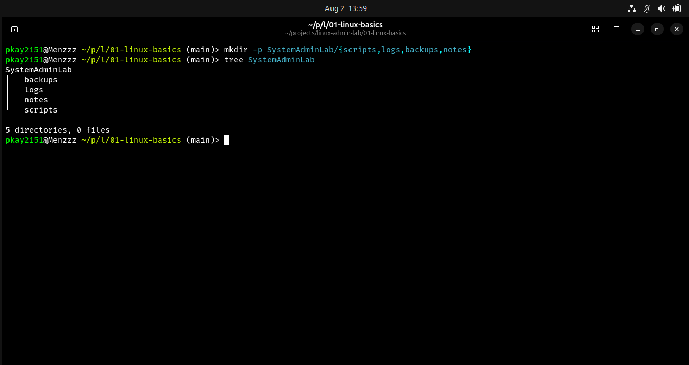

# Linux Basics - Navigation and File System Exploration

## Objective

The objective of this lab was to understand basic Linux navigation commands and explore the Linux file system structure.

## Environment

- Operating System: Ubuntu Linux
- Shell: Fish
- Version Control: Git and GitHub

## Commands Practiced

| Command | Description |
|---------|-------------|
| pwd | Displays the current working directory |
| ls | Lists files and directories |
| ls -l | Displays detailed file information |
| ls -a | Displays hidden files |
| cd | Changes directories |
| mkdir | Creates directories |
| tree | Displays directory structure |

## Tasks Completed

### 1. Checking Current Location

Used the `pwd` command to identify the current directory location.

### 2. Listing Files and Directories

Used:
- `ls`
- `ls -l`
- `ls -a`

to view files, permissions, ownership, and hidden files.

### 3. Exploring the Root Directory

Navigated to `/` and explored the main Linux directories.

Examples:

- `/home` - User home directories
- `/etc` - System configuration files
- `/usr` - User programs and utilities
- `/var` - Variable data such as logs

### 4. Creating System Administrator Workspace

Created the following structure:
SystemAdminLab
├── backups
├── logs
├── notes
└── scripts

This structure will be used for future administration tasks.

## Screenshots

### Current Location and Listing

### Root Directory Exploration

### System Administrator Workspace

