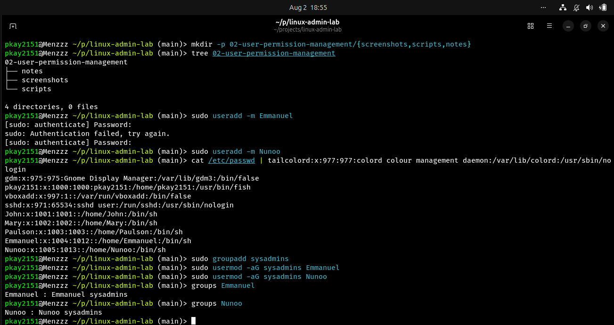
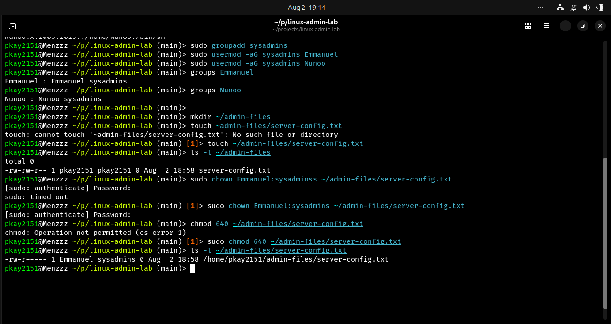

# User and Permission Management

## Objective

The objective of this lab was to learn how to create Linux users, manage groups, assign users to groups, and control file ownership and permissions.

## Environment

- Operating System: Ubuntu Linux
- Shell: Fish
- Version Control: Git and GitHub

## Commands Practiced

| Command | Description |
|---------|-------------|
| useradd | Creates a new user |
| groupadd | Creates a new group |
| usermod | Modifies a user account |
| groups | Displays the groups a user belongs to |
| chown | Changes file ownership |
| chmod | Changes file permissions |
| ls -l | Displays file permissions and ownership |

## Tasks Completed

### 1. Created Users

Created two practice users:

- Emmanuel
- Nunoo

Verified their creation using:

```fish
cat /etc/passwd | tail
```

### 2. Created a Group

Created a group named:

```
sysadmins
```

Added both users to the group using:

```fish
sudo usermod -aG sysadmins Emmanuel
sudo usermod -aG sysadmins Nunoo
```

Verified group membership using:

```fish
groups Emmanuel
groups Nunoo
```

### 3. File Ownership

Created a practice file and changed its ownership to:

- Owner: Emmanuel
- Group: sysadmins

using:

```fish
sudo chown alice:sysadmins server-config.txt
```

### 4. File Permissions

Assigned permissions:

```text
640
```

Meaning:

- Owner: Read and Write
- Group: Read only
- Others: No access

## Screenshots

### User Creation



### Groups and Permissions




