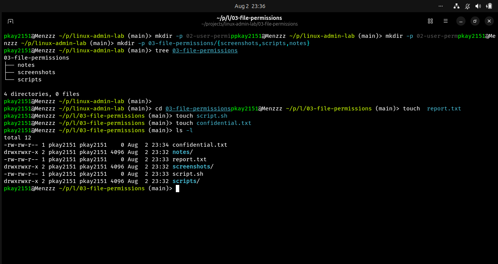
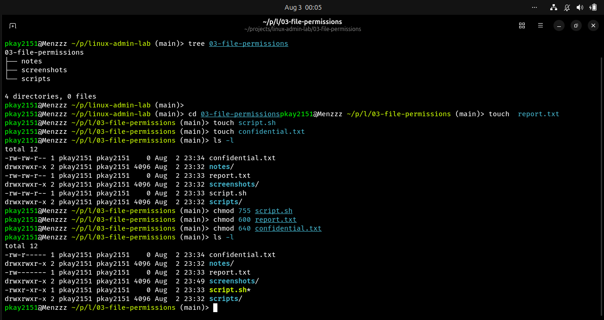
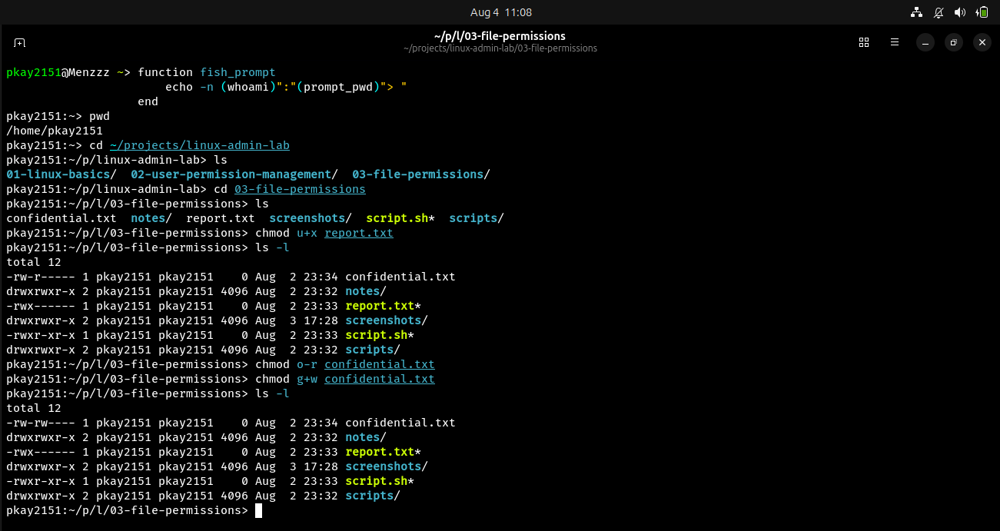

# File Permissions in Linux

## Objective

The objective of this lab was to understand file permissions, ownership, and access control using both numeric and symbolic permission modes in linux.

## Environment

- Operating System: Ubuntu Linux
- Shell: Bash/Fish
- Version Control: Git and GitHub

## Commands Practiced

| Command | Description |
|---------|-------------|
| ls -l | View file permissions |
| chmod | Change file permissions |
| chown | Change file ownership |
| chgrp | Change group ownership |

## Tasks Completed

### 1. Created Practice Files

Created the following files:

- report.txt
- script.sh
- confidential.txt

### 2. Viewed Default Permissions

Used:

```Bash
ls -l
```

to examine the default permissions assigned to newly created files.

### 3. Applied Numeric Permissions

Configured the files as follows:

- script.sh → 755
- report.txt → 600
- confidential.txt → 640

### 4. Applied Symbolic Permissions

Practiced:

- chmod u+x
- chmod g+w
- chmod o-r

to understand how symbolic permissions modify access rights.

## Screenshots

### Default Permissions



### Numeric Permissions



### Symbolic Permissions


