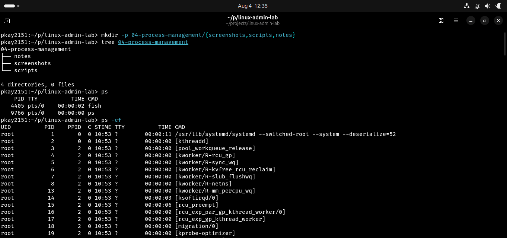
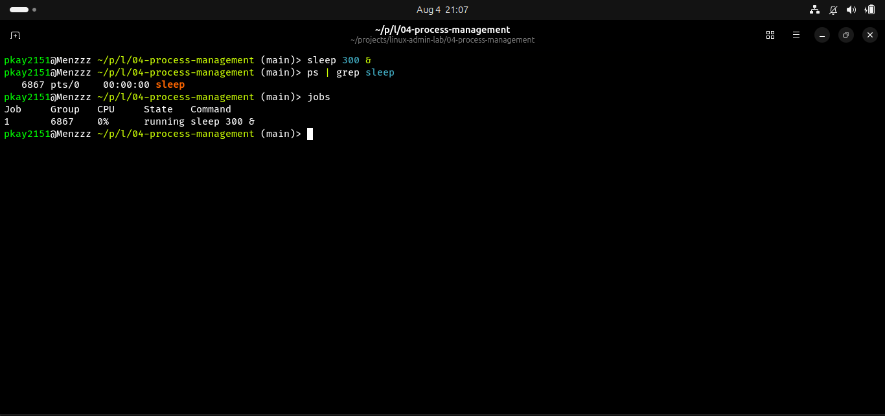
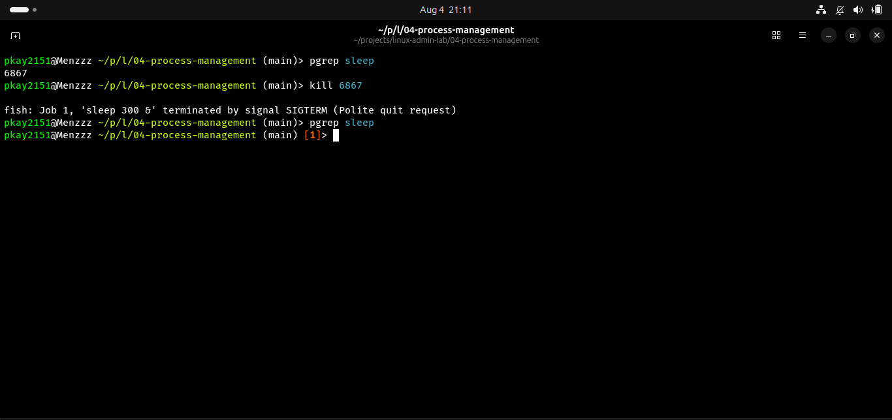

# Process Management in Linux

## Objective

The objective of this lab was to understand how Linux manages running processes and how to monitor, identify, and terminate processes safely.

## Real-World Scenario

A Linux server becomes slow because one application is consuming excessive system resources. As the system administrator, you need to identify the process, monitor its activity, and stop it without affecting the rest of the system.

## Environment

- Operating System: Ubuntu Linux
- Shell: Bash/Fish
- Version Control: Git and GitHub

## Commands Practiced

| Command | Description |
|---------|-------------|
| ps | Display running processes |
| ps aux | Display detailed information about all running processes |
| top | Monitor processes in real time |
| sleep | Create a temporary background process |
| pgrep | Find a process by name |
| kill | Terminate a running process |

## Tasks Completed

### 1. Viewed Running Processes

Used:

```bash
ps
ps aux | head -20
```

to examine running processes and understand process information such as PID, CPU usage, and memory usage.

### 2. Monitored Processes

Used:

```bash
top
```

to observe system activity and running processes in real time.

### 3. Created a Background Process

Executed:

```bash
sleep 300 &
```

to start a background process for testing.

### 4. Located the Process

Used:

```bash
pgrep sleep
```

to identify the Process ID (PID) of the background process.

### 5. Terminated the Process

Stopped the process using:

```bash
kill <PID>
```

and confirmed it had ended successfully.

## Screenshots

### Running Processes



### Background Process



### Killing a Process


