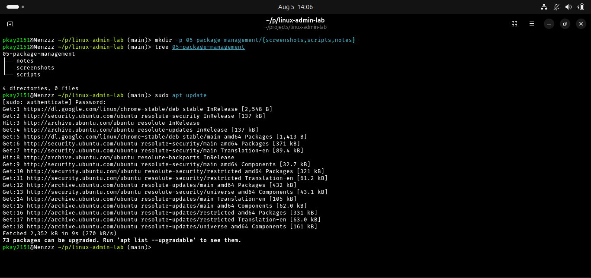
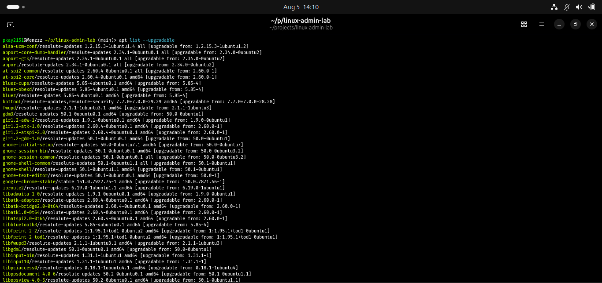
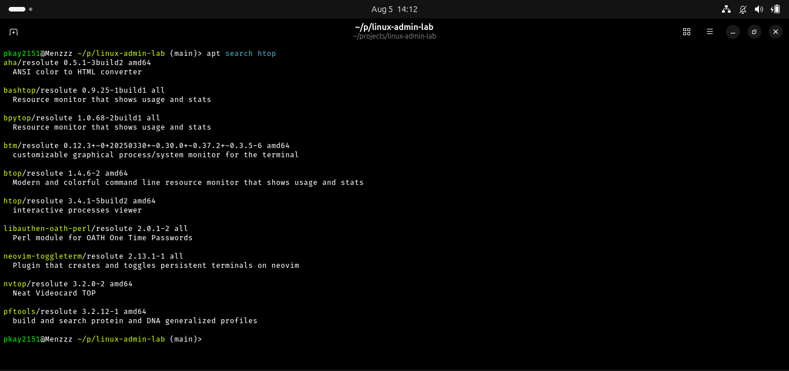
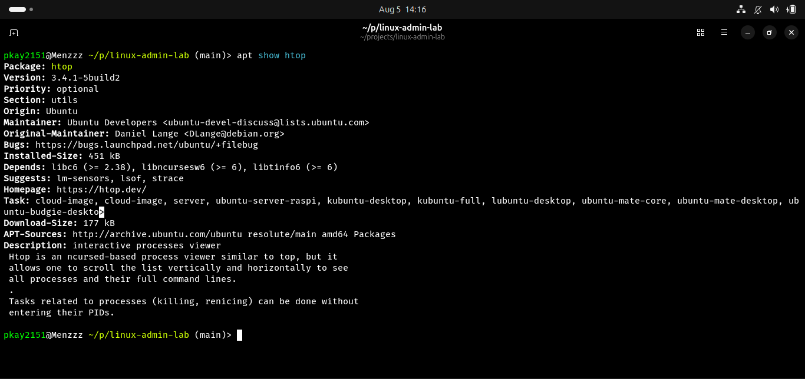
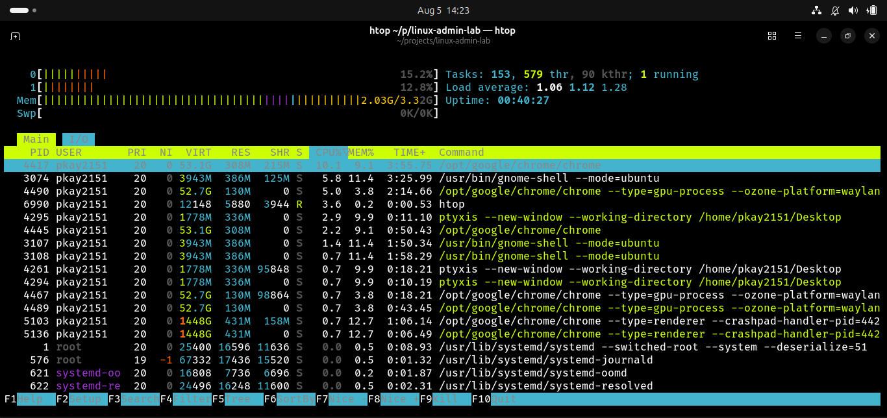
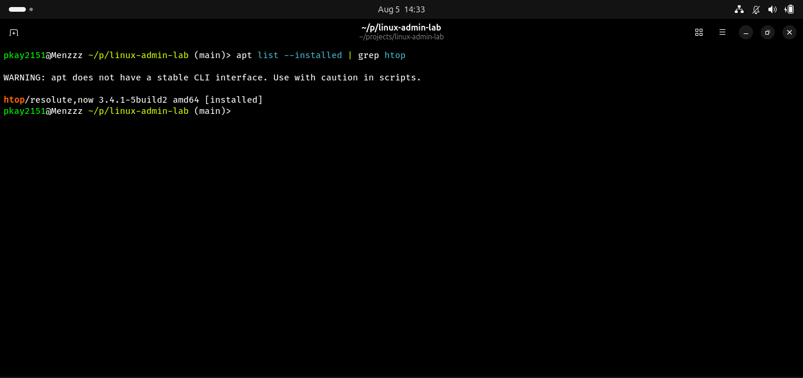
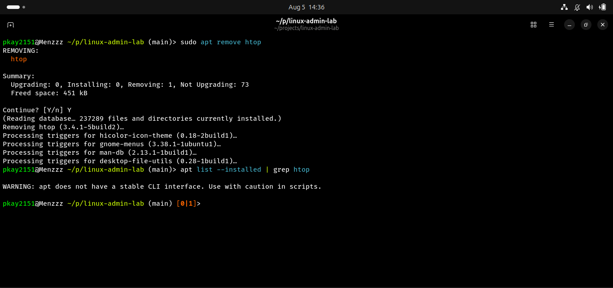

# Package Management

## Objective

The objective of this lab was to learn how to manage software packages in Ubuntu using the APT package manager. This included updating package repositories, searching for packages, installing software, verifying installations, and removing packages.

## Real-World Scenario

As a Linux System Administrator, users often request new software installations or the removal of unnecessary applications. Keeping software up to date and managing packages securely is an essential administrative responsibility.

## Environment

- Operating System: Ubuntu Linux
- Package Manager: APT
- Version Control: Git and GitHub

## Commands Practiced

| Command | Description |
|---------|-------------|
| sudo apt update | Update package lists |
| apt list --upgradable | View available package updates |
| apt search | Search for packages |
| apt show | Display package information |
| sudo apt install | Install a package |
| apt list --installed | Verify installed packages |
| sudo apt remove | Remove a package |

## Tasks Completed

### 1. Updated Package Lists

```fish
sudo apt update
```

Downloaded the latest package information from Ubuntu repositories.

### 2. Checked for Available Updates

```fish
apt list --upgradable
```

Displayed packages that could be upgraded.

### 3. Searched for a Package

```fish
apt search htop
```

Located the `htop` package in the Ubuntu repositories.

### 4. Viewed Package Details

```fish
apt show htop
```

Displayed version, maintainer, dependencies, and package description.

### 5. Installed the Package

```fish
sudo apt install htop
```

Installed the `htop` system monitoring utility.

### 6. Verified Installation

```fish
apt list --installed | grep htop
```

Confirmed that `htop` had been installed successfully.

### 7. Removed the Package

```fish
sudo apt remove htop
```

Removed the package from the system.

## Screenshots

### Updating Package Lists



### Upgradable Packages



### Searching for a Package



### Viewing Package Information



### Running htop



### Verifying Installation



### Removing the Package



