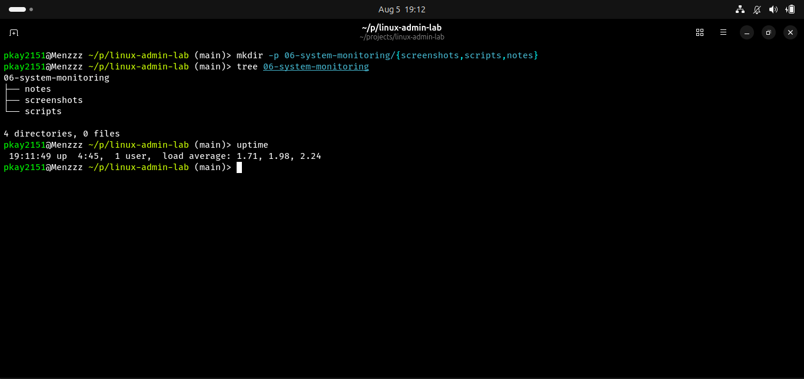
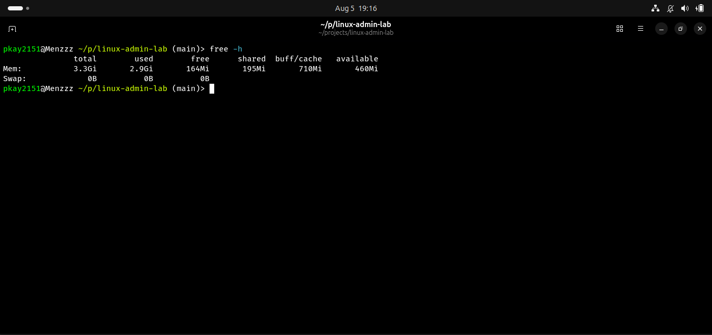
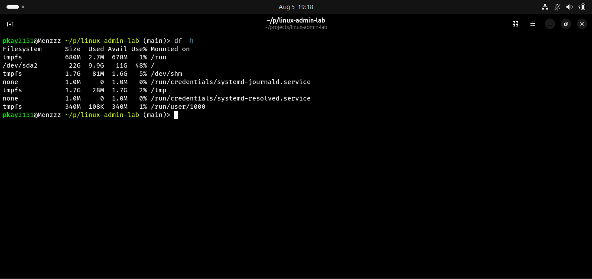
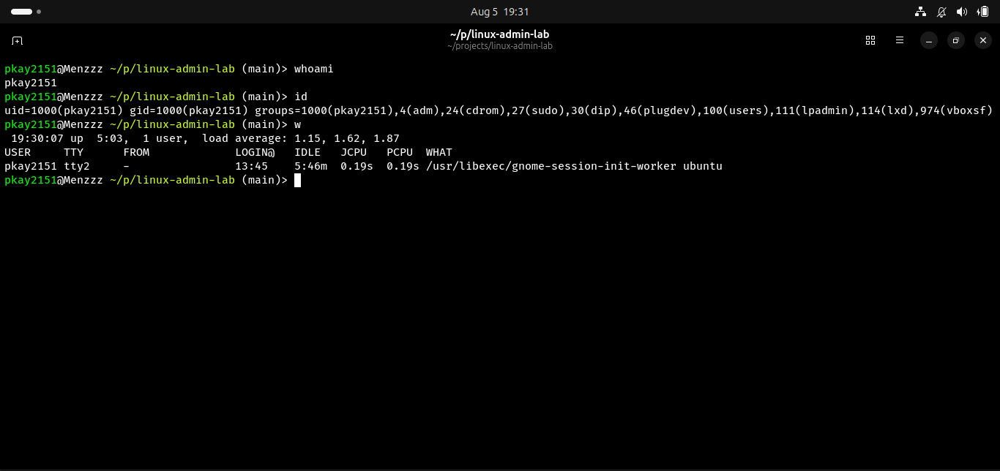
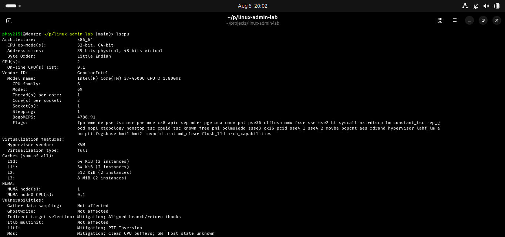
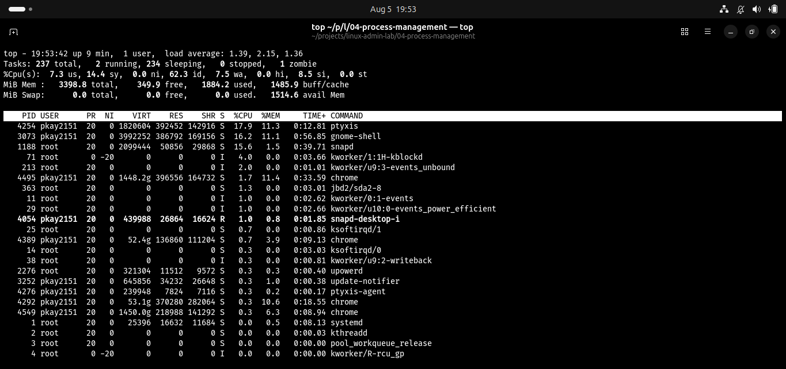
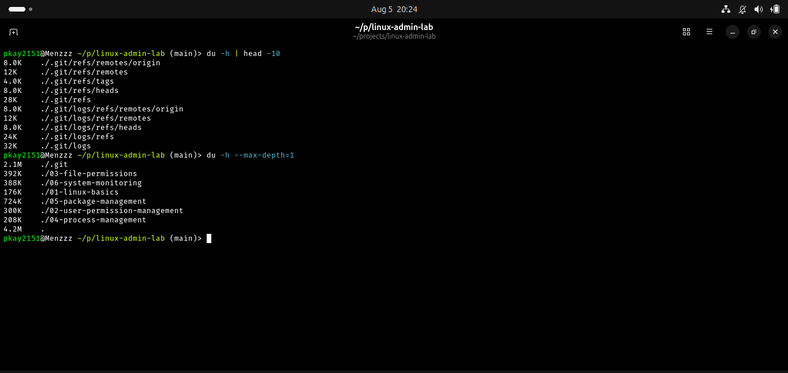

# System Monitoring in Linux

## Objective

The objective of this lab was to learn how to monitor the health and performance of a Linux system. This included checking system uptime, memory usage, disk usage, CPU information, running processes, and directory storage consumption.

## Real-World Scenario

A company reports that one of its Linux servers is becoming slow. As a system administrator, you need to investigate the system without restarting it. You check CPU usage, available memory, disk space, and running processes to identify possible problems.

## Environment

- Operating System: Ubuntu Linux
- Shell: Bash/Fish
- Version Control: Git and GitHub

## Commands Practiced

| Command | Purpose |
|---------|---------|
| uptime | Shows system uptime and load average |
| free -h | Displays memory usage in human-readable format |
| df -h | Shows disk space usage |
| who | Displays logged-in users |
| whoami | Shows the current user |
| id | Displays user and group information |
| lscpu | Displays CPU information |
| top | Monitors running processes and system resources |
| du -h | Shows directory sizes |

## Tasks Completed

### 1. Checked System Uptime

Command:

```bash
uptime
```

Used to view how long the system has been running and check system load averages.

### 2. Checked Memory Usage

Command:

```bash
free -h
```

The `-h` option displays memory values in a human-readable format such as MB and GB.

### 3. Checked Disk Usage

Command:

```bash
df -h
```

Used to check available and used disk space.

### 4. Checked User Information

Commands:

```bash
whoami
id
```

Used to identify logged-in users and display account information.

### 5. Checked CPU Information

Command:

```bash
lscpu
```

Used to view processor architecture, cores, threads, and CPU details.

### 6. Monitored Running Processes

Command:

```bash
top
```

Used for real-time monitoring of CPU, memory, and running processes.

### 7. Checked Directory Sizes

Command:

```bash
du -h --max-depth=1
```

Used to identify how much storage directories consume.

## Screenshots

1. Uptime Check 


2. Memory Usage 


3. Disk Usage 


4. User Information


5. CPU Information 


6. Process Monitoring


7. Directory Size

