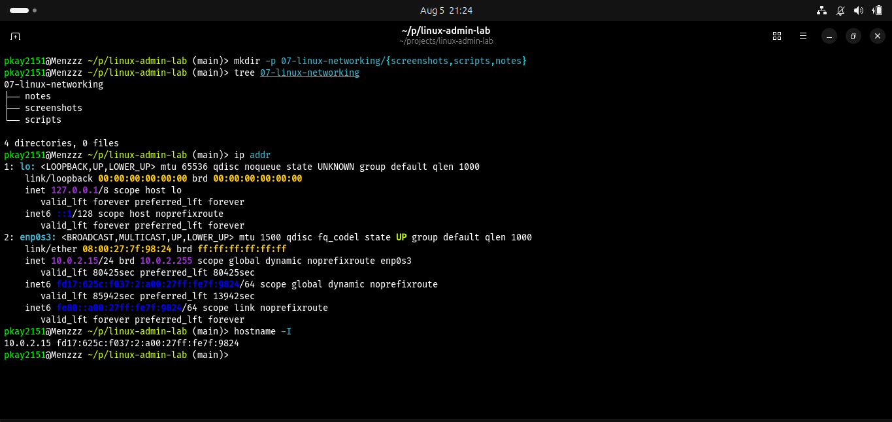
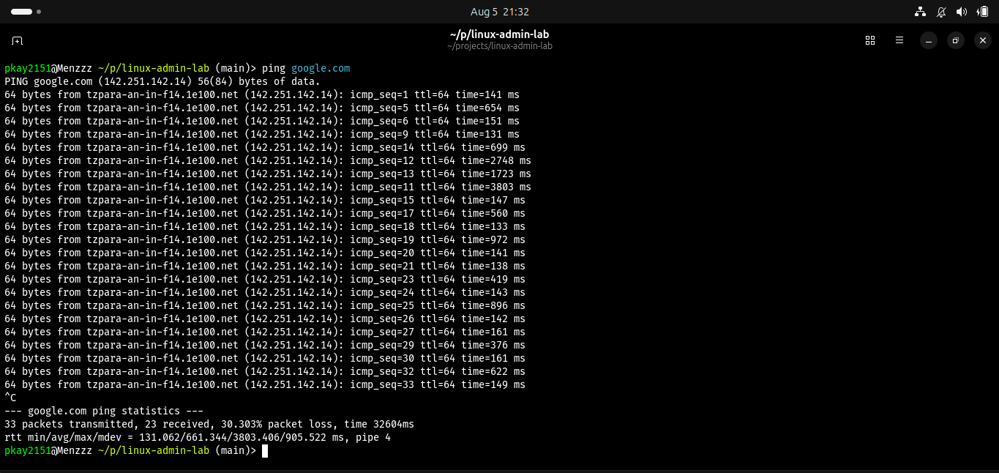
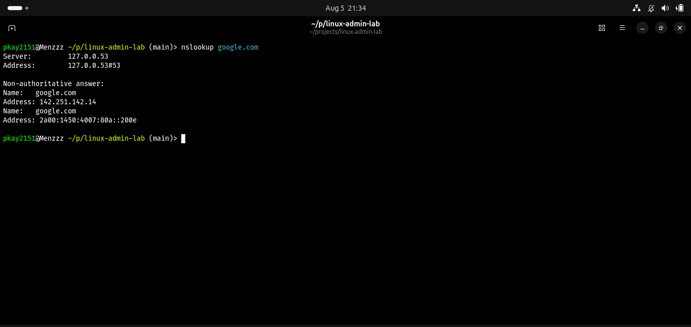
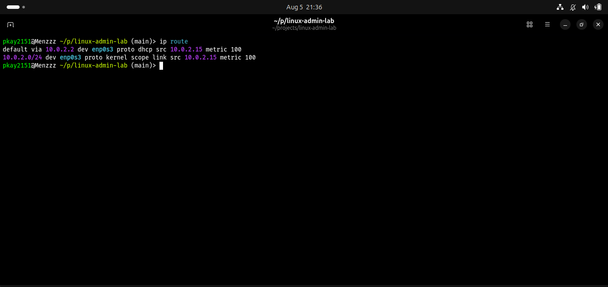
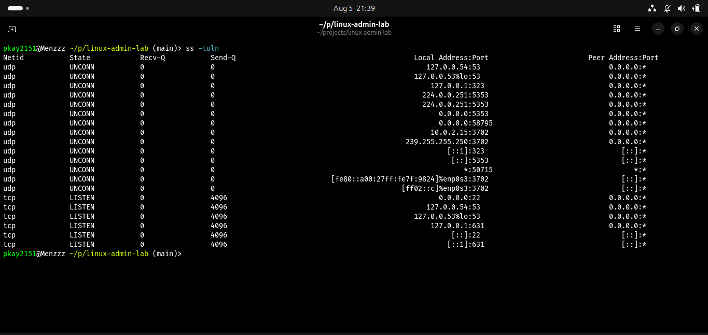

# Linux Networking Fundamentals

## Objective

The objective of this lab was to learn basic Linux networking commands used by system administrators to troubleshoot connectivity issues, inspect network configurations, and identify active network services.

## Real-World Scenario

A user reports that they cannot access a company application server. As a Linux administrator, you need to investigate whether the problem is caused by network configuration, connectivity, DNS, routing, or unavailable services.

## Environment

- Operating System: Ubuntu Linux
- Shell: Fish
- Version Control: Git and GitHub

## Commands Practiced

| Command | Purpose |
|---------|---------|
| ip addr | Display network interfaces and IP addresses |
| hostname -I | Display system IP address |
| ping | Test network connectivity |
| nslookup | Check DNS resolution |
| ip route | Display routing table |
| ss -tuln | Display listening network ports |

## Tasks Completed

### 1. Viewed Network Interfaces

Command:

```bash
ip addr
```

Used to identify network interfaces and assigned IP addresses.

### 2. Checked IP Address

Command:

```bash
hostname -I
```

Used as a quick way to display the machine's IP address.

### 3. Tested Connectivity

Command:

```bash
ping google.com
```

Used to verify whether the system could communicate with an external host.

### 4. Checked DNS Resolution

Command:

```bash
nslookup google.com
```

Used to confirm that domain names can be translated into IP addresses.

### 5. Viewed Routing Information

Command:

```bash
ip route
```

Used to view the paths Linux uses to send network traffic.

### 6. Checked Listening Ports

Command:

```bash
ss -tuln
```

Used to identify active listening network ports and services.

## Screenshots

### Network Interface and IP Address



### Ping Test



### DNS Resolution



### Routing Table



### Listening Ports


