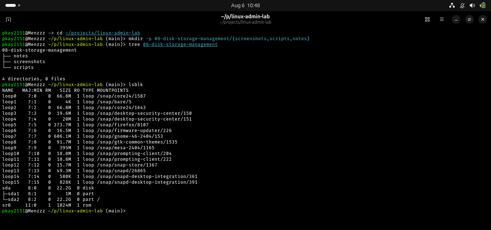
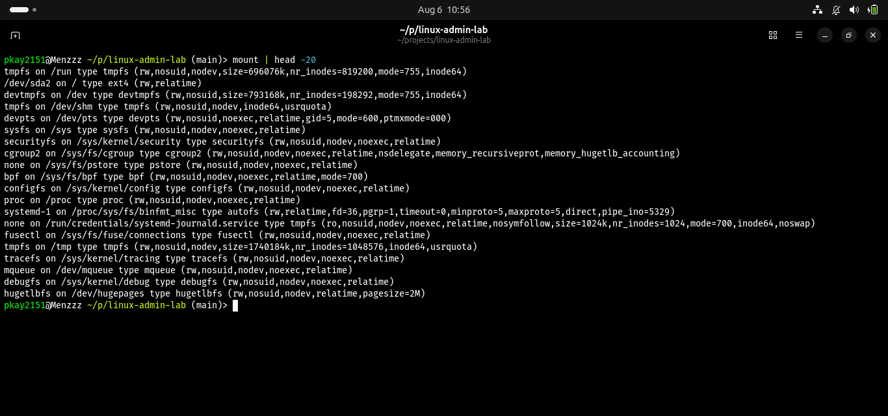
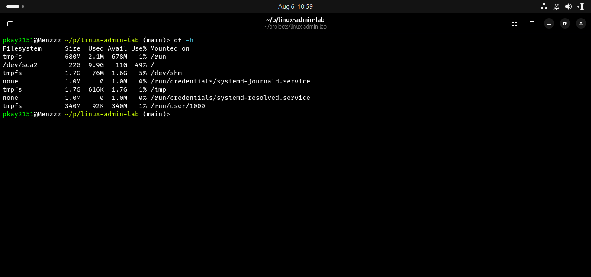
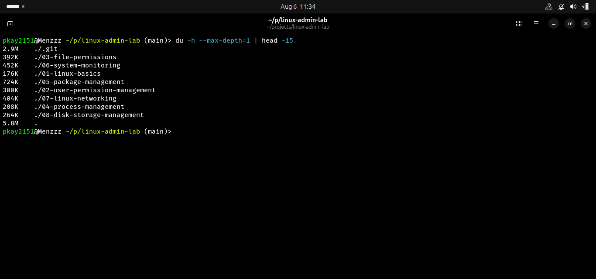
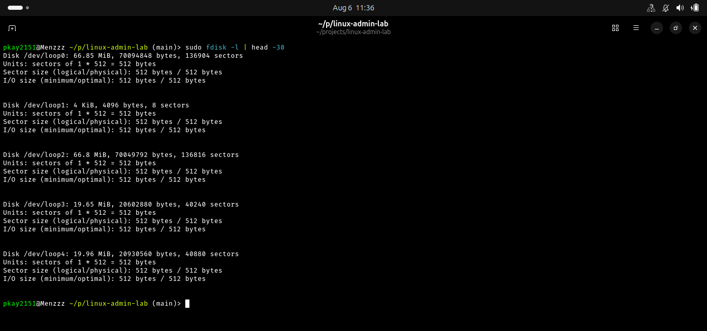
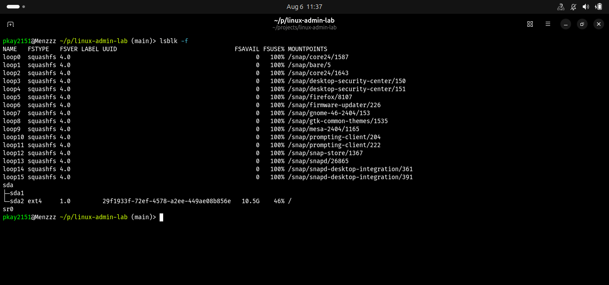

# Disk and Storage Management in Linux

## Objective

The objective of this lab was to learn how Linux administrators inspect and manage storage. This included viewing block devices, checking mounted filesystems, monitoring disk usage, analyzing directory sizes, and identifying filesystem types.

## Real-World Scenario

A company server sends an alert that disk space is running low. As a Linux administrator, you need to investigate which storage devices exist, how much space is available, which directories are consuming storage, and what filesystems are being used.

## Environment

- Operating System: Ubuntu Linux
- Shell: Bash/Fish
- Version Control: Git and GitHub

## Commands Practiced

| Command | Purpose |
|---------|---------|
| lsblk | Display block devices and partitions |
| mount | Display mounted filesystems |
| df -h | Show filesystem disk usage |
| du -h | Show directory sizes |
| fdisk -l | Display disk partition information |
| lsblk -f | Display filesystem types |

## Tasks Completed

### 1. Viewed Block Devices

Command:

```bash
lsblk
```

Used to display available disks, partitions, sizes, and mount points.

### 2. Viewed Mounted Filesystems

Command:

```bash
mount
```

Used to view filesystems currently mounted on the Linux system.

### 3. Checked Filesystem Usage

Command:

```bash
df -h
```

The `-h` option displays storage information in a human-readable format such as MB and GB.

### 4. Checked Directory Usage

Command:

```bash
du -h --max-depth=1
```

Used to identify how much storage directories consume.

### 5. Viewed Disk Partitions

Command:

```bash
sudo fdisk -l
```

Used to display detailed information about disks and partition layouts.

### 6. Checked Filesystem Types

Command:

```bash
lsblk -f
```

Used to identify filesystem formats such as ext4 and xfs.

## Screenshots

### Block Devices



### Mounted Filesystems



### Filesystem Usage



### Directory Usage



### Disk Partitions



### Filesystem Types


