# User Management and Security Administration in Linux

## Objective

The objective of this lab was to learn how Linux administrators manage user accounts, groups, passwords, ownership, and permissions. The lab also demonstrated how to lock, unlock, and remove user accounts as part of system security.

## Real-World Scenario

A new employee joins a company and requires access to the development environment. As the Linux administrator, you are responsible for creating the user account, assigning the appropriate group, configuring permissions, securing the account, and removing access when it is no longer needed.

## Environment

- Operating System: Ubuntu Linux
- Shell: Bash/Fish
- Version Control: Git and GitHub

## Commands Practiced

| Command | Purpose |
|---------|---------|
| useradd | Create a new user |
| groupadd | Create a new group |
| usermod | Add a user to a group |
| passwd | Set, lock, and unlock user passwords |
| id | Display user information |
| groups | Display a user's group membership |
| chown | Change file or directory ownership |
| chmod | Change file or directory permissions |
| userdel | Remove a user account |

## Tasks Completed

### 1. Created a User

Command:

```bash
sudo useradd -m -s /bin/bash Aunt
id Aunt
```

Created a new user account with a home directory and Bash as the default shell.

### 2. Created a Group

Command:

```bash
sudo groupadd developers
getent group developers
```

Created a new group for development team members.

### 3. Added the User to the Group

Command:

```bash
sudo usermod -aG developers Aunt
groups Aunt
```

Added the user to the developers group.

### 4. Set the User Password

Command:

```bash
sudo passwd Aunt
```

Assigned a password to the user account.

### 5. Viewed User Information

Command:

```bash
grep Aunt /etc/passwd
```

Displayed information about the user account.

### 6. Changed Directory Ownership

Command:

```bash
sudo chown root:developers /opt/development
```

Changed the group ownership of the shared development directory.

### 7. Changed Directory Permissions

Command:

```bash
sudo chmod 770 /opt/development
```

Allowed only the owner and group members to access the directory.

### 8. Tested User Access

Commands:

```bash
su - Aunt
cd /opt/development
touch project.txt
ls -l
exit
```

Verified that the user could access the shared directory and create files.

### 9. Locked and Unlocked the User Account

Commands:

```bash
sudo passwd -l Aunt
sudo passwd -S Aunt
sudo passwd -u Aunt
sudo passwd -S Aunt
```

Demonstrated how to temporarily disable and restore access to a user account.

### 10. Removed the User

Command:

```bash
sudo userdel -r Aunt
```

Removed the test user account and its home directory after completing the lab.

## Screenshots

### Create User

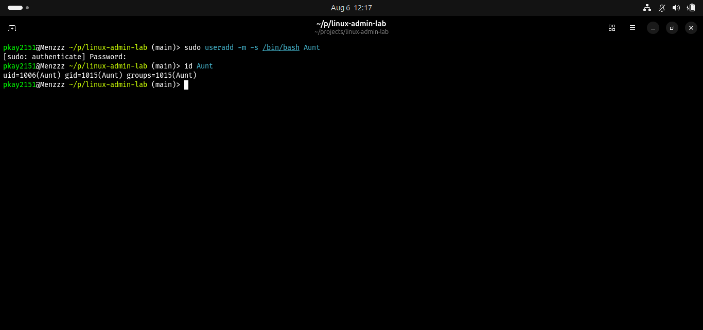

### Create Group

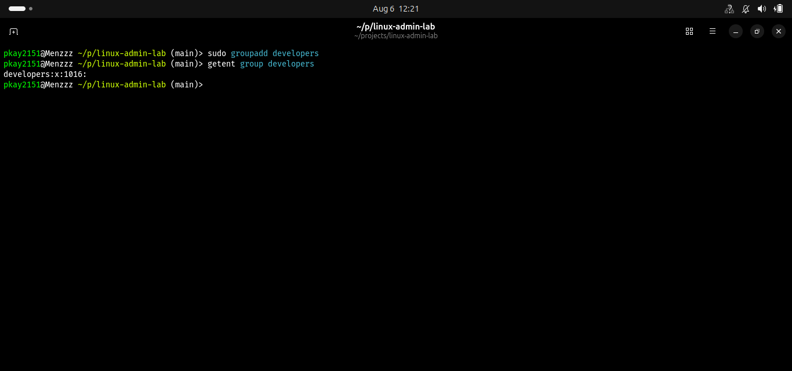

### User Group Membership

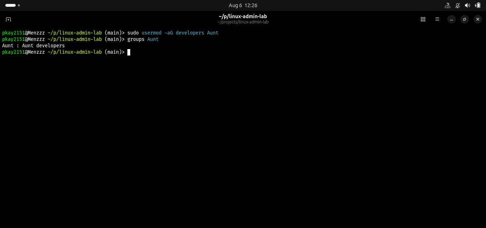

### Set Password

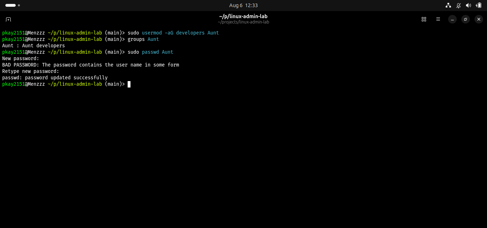

### User Information

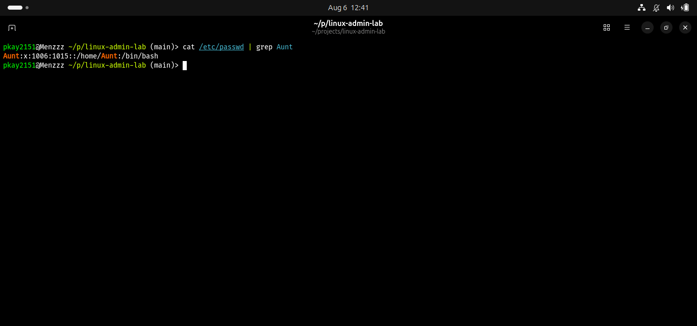

### Change Ownership

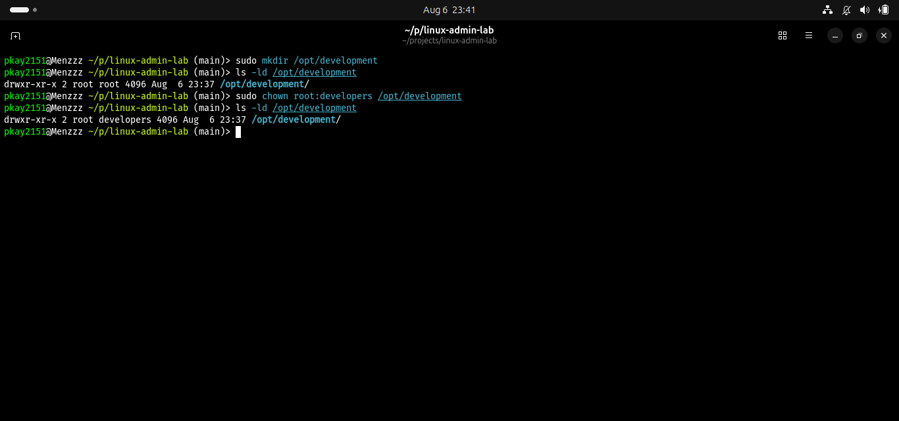

### Directory Permissions

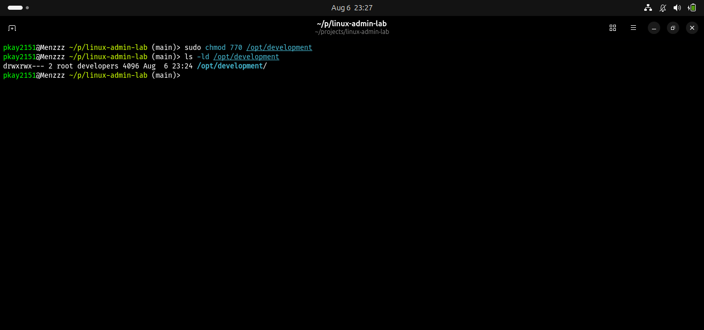

### User Access Test

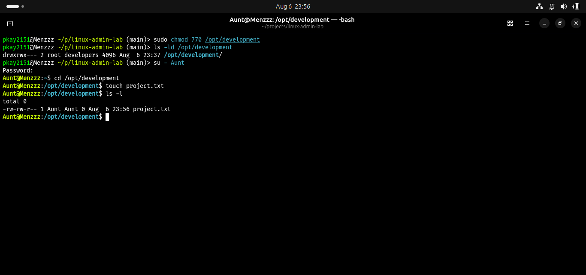

### Lock User

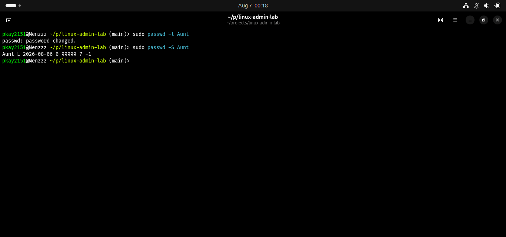

### Unlock User

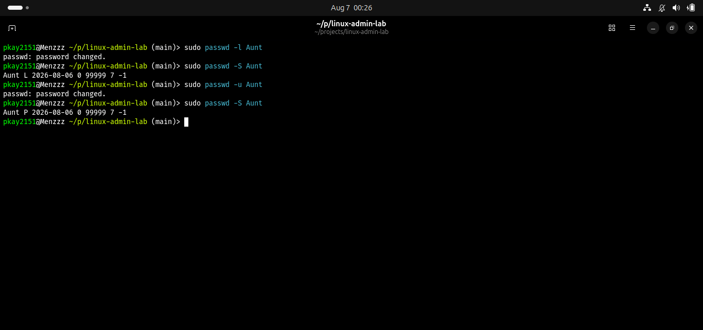

### Remove User

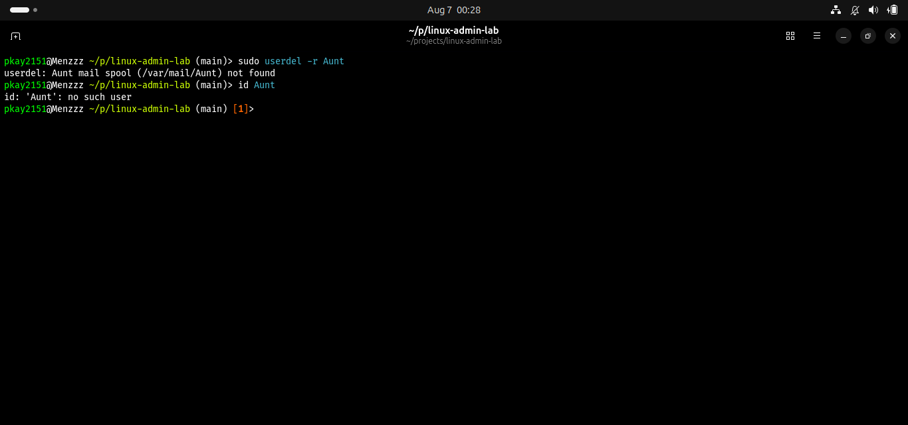
