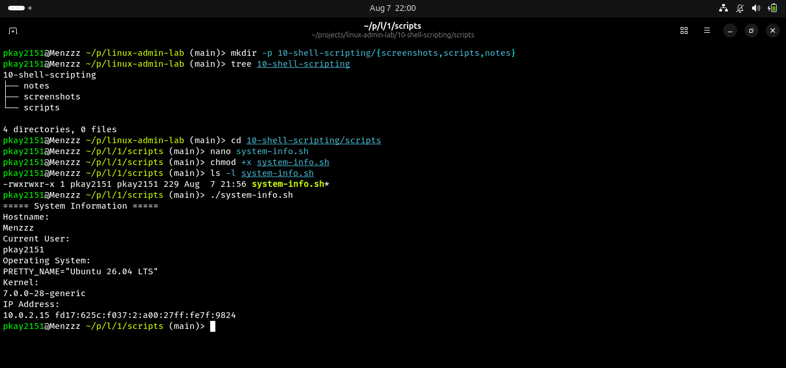
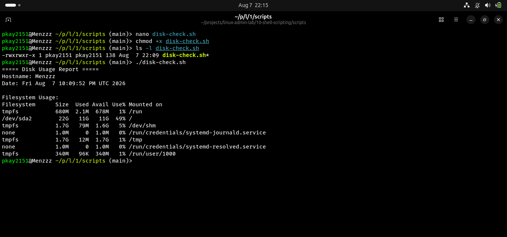
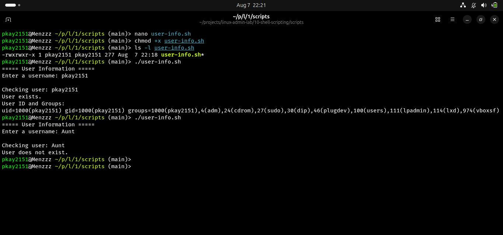
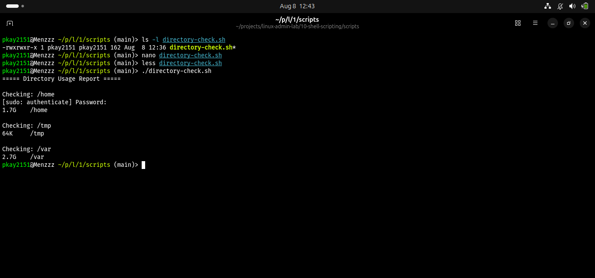
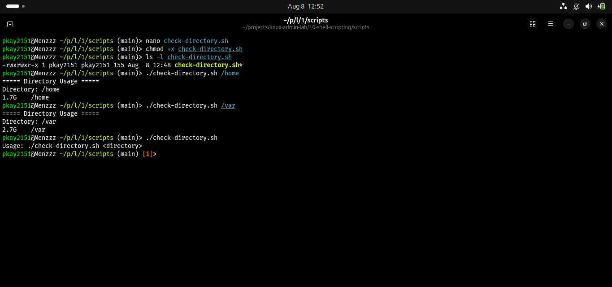
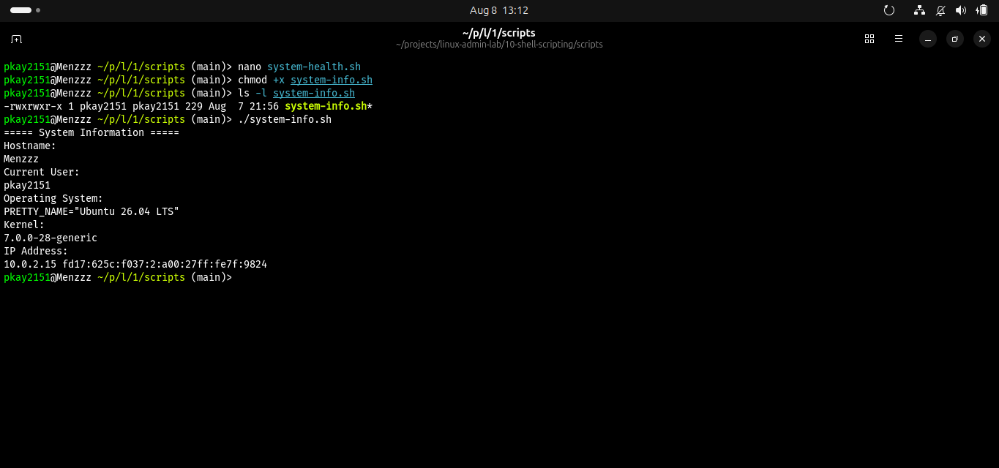

# Shell Scripting in Linux

## Objective

The objective of this lab was to learn how Bash shell scripts can be used to automate common Linux administration tasks. The lab covered variables, user input, conditional statements, loops, command-line arguments, and combining multiple Linux commands into automated scripts.

## Real-World Scenario

A Linux system administrator frequently performs repetitive tasks such as checking system information, monitoring disk usage, checking users, and reviewing system health. Instead of executing each command manually, shell scripts can automate these tasks and improve efficiency.

## Environment

- Operating System: Ubuntu Linux
- Shell: Bash/Fish
- Version Control: Git and GitHub

## Commands and Concepts Practiced

| Command / Concept | Purpose |
|-------------------|---------|
| `echo` | Display messages and information |
| `read` | Accept user input |
| `if` | Perform conditional checks |
| `for` | Repeat commands using a loop |
| `chmod +x` | Make a script executable |
| `$1` | Access the first command-line argument |
| `$(command)` | Insert command output into a script |
| `hostname` | Display the system hostname |
| `whoami` | Display the current user |
| `df -h` | Display filesystem usage |
| `du -sh` | Display directory size |
| `free -h` | Display memory usage |
| `uptime` | Display system uptime and load |

## Tasks Completed

### 1. Created a System Information Script

Script:

```bash
./scripts/system-info.sh
```

The script displays the hostname, current user, operating system, kernel version, and IP address.

### 2. Created a Disk Usage Script

Script:

```bash
./scripts/disk-check.sh
```

The script displays the hostname, date, and filesystem disk usage.

### 3. Used Variables, User Input, and Conditions

Script:

```bash
./scripts/user-info.sh
```

The script accepts a username as input and checks whether the user exists on the system.

### 4. Used a For Loop

Script:

```bash
./scripts/directory-check.sh
```

The script loops through `/home`, `/tmp`, and `/var` and displays their disk usage.

### 5. Used Command-Line Arguments

Script:

```bash
./scripts/check-directory.sh /home
```

The script accepts a directory as a command-line argument and displays its disk usage.

### 6. Created a System Health Check

Script:

```bash
./scripts/system-health.sh
```

The script combines several Linux commands to display basic system health information, including uptime, memory usage, disk usage, and system load.

## Screenshots

### System Information Script



### Disk Usage Script



### User Information Script



### Directory Loop



### Command-Line Arguments



### System Health Check


