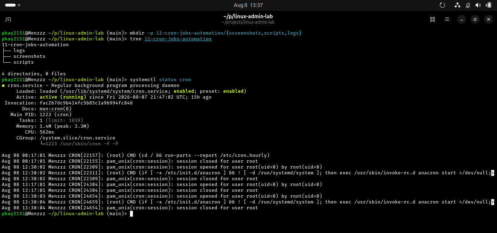
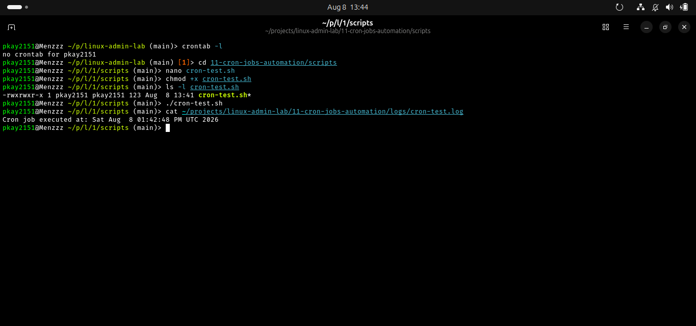
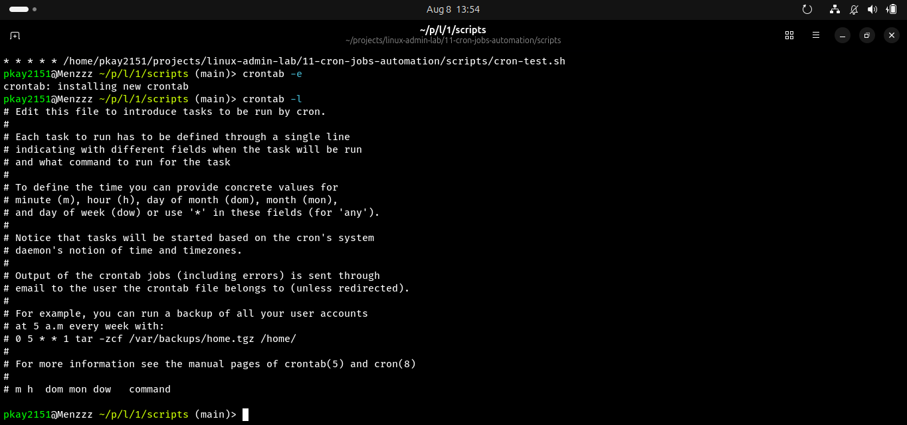
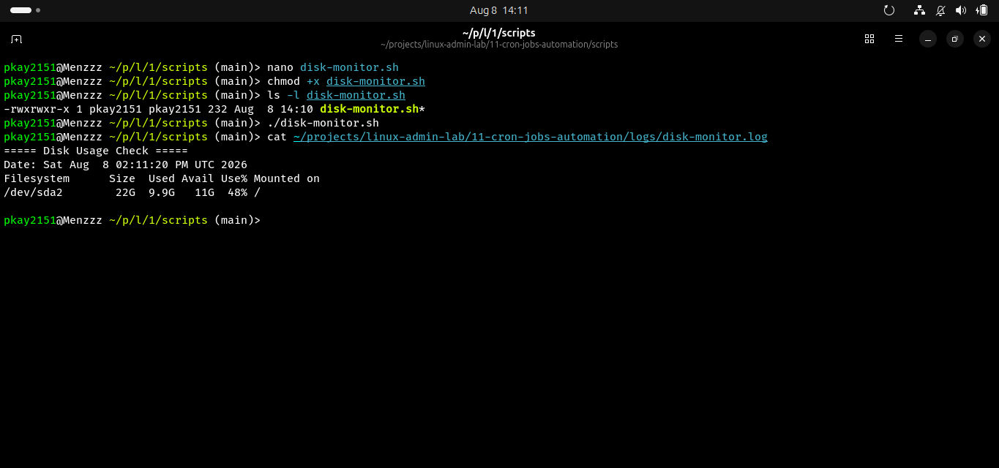

# Cron Jobs and Automation in Linux

## Objective

The objective of this lab was to learn how Linux administrators schedule and automate tasks using the cron service. The lab covered checking the cron service, creating executable scripts, scheduling tasks with crontab, monitoring automated execution through log files, and removing scheduled jobs.

## Real-World Scenario

A Linux administrator needs to automate routine maintenance and monitoring tasks. Instead of manually running these tasks, cron can execute scripts automatically at scheduled times. In this lab, cron was used to automatically record execution times and monitor disk usage.

## Environment

- Operating System: Ubuntu Linux
- Shell: Bash/Fish
- Version Control: Git and GitHub
- Scheduling Service: cron

## Commands and Concepts Practiced

| Command / Concept | Purpose |
|-------------------|---------|
| `systemctl status cron` | Check the status of the cron service |
| `crontab -l` | Display scheduled cron jobs |
| `crontab -e` | Edit the user's scheduled cron jobs |
| `chmod +x` | Make scripts executable |
| `>>` | Append output to a file |
| `$(command)` | Insert command output into a script |
| Cron syntax | Schedule commands and scripts |

## Tasks Completed

### 1. Checked the Cron Service

Command:

```bash
systemctl status cron
```

Used to verify that the cron service was active and running.

### 2. Checked Existing Cron Jobs

Command:

```bash
crontab -l
```

Used to display the user's currently scheduled cron jobs.

### 3. Created a Cron Test Script

Script:

```bash
./scripts/cron-test.sh
```

The script records the date and time whenever it is executed.

### 4. Scheduled an Automatic Cron Job

Cron entry:

```cron
* * * * * /home/pkay2151/projects/linux-admin-lab/11-cron-jobs-automation/scripts/cron-test.sh
```

The five fields represent:

```text
minute hour day-of-month month day-of-week
```

The `* * * * *` schedule runs the script every minute.

### 5. Verified Automatic Execution

The cron job automatically wrote execution timestamps to:

```text
logs/cron-test.log
```

This demonstrated that cron was executing the script without manually running it.

### 6. Removed the Scheduled Cron Job

The scheduled entry was removed using:

```bash
crontab -e
```

The cron job was then verified as removed using:

```bash
crontab -l
```

### 7. Created a Disk Monitoring Script

Script:

```bash
./scripts/disk-monitor.sh
```

The script records the current disk usage of the root filesystem and saves the results to:

```text
logs/disk-monitor.log
```

The script can also be scheduled with cron for continuous automated monitoring.

## Screenshots

### Cron Service Status



### Cron Test Script



### Scheduled Cron Job


### Cron Job Execution


### Cron Job Removed



### Disk Monitoring Script


