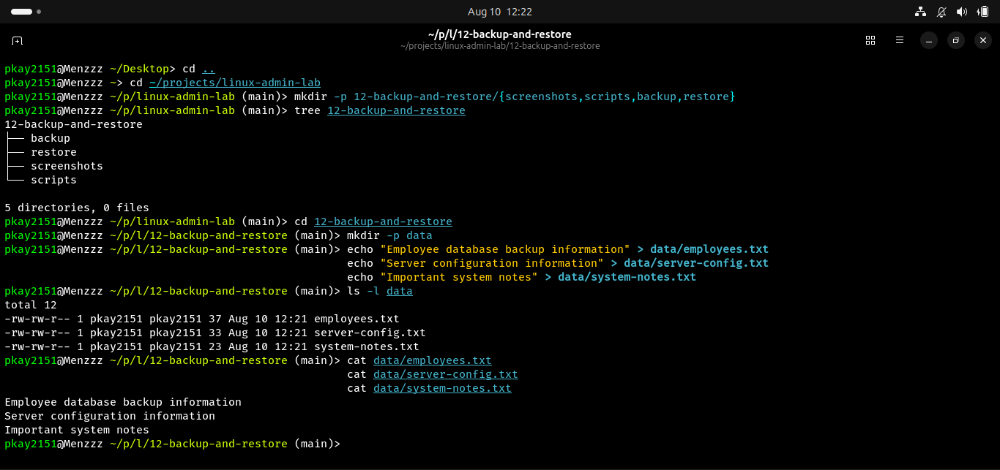
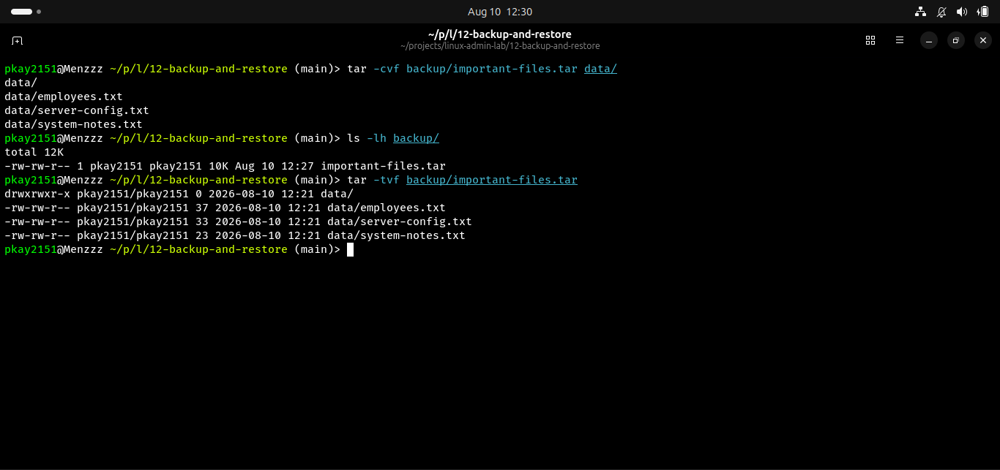
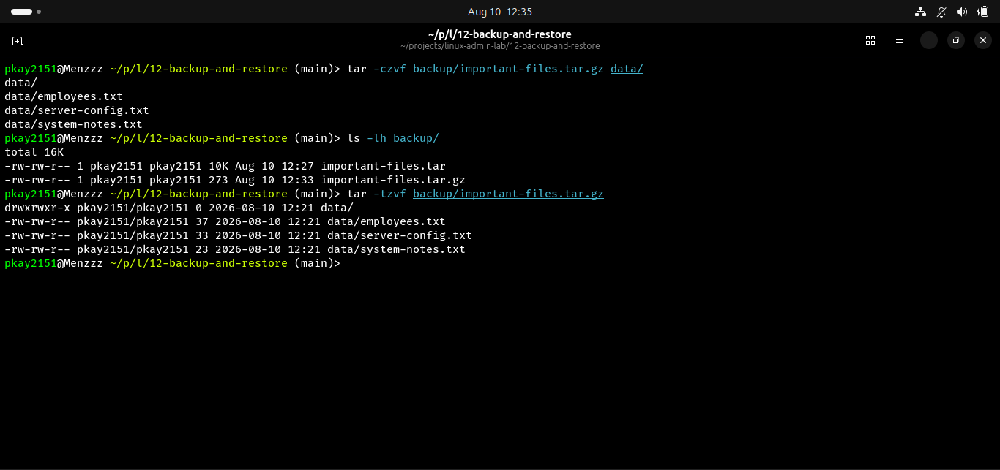
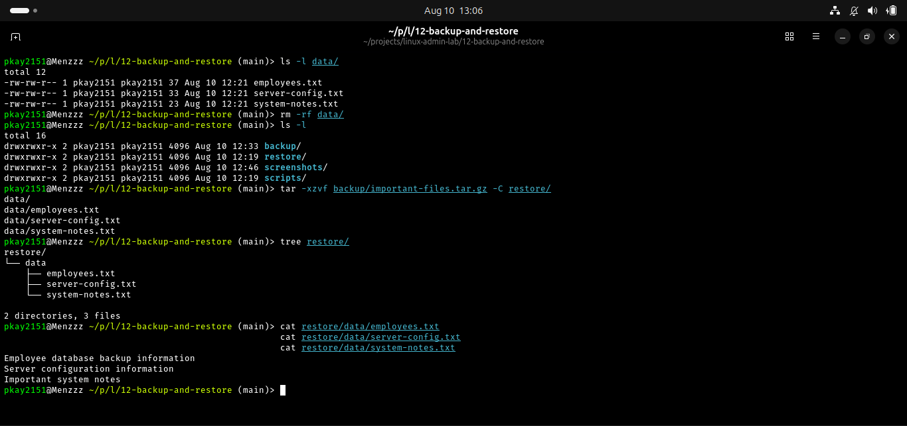
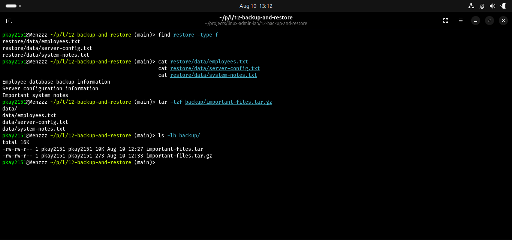

# Backup and Restore in Linux

## Objective

The objective of this lab was to learn how Linux administrators create, manage, and restore backups. The lab covered creating archive files with `tar`, compressing backups with gzip, inspecting archive contents, simulating data loss, restoring files, and verifying recovered data.

## Real-World Scenario

A Linux administrator needs to protect important system and application data from accidental deletion or system failure. In this lab, sample files were created, backed up, compressed, intentionally deleted, and then restored from the backup.

## Environment

- Operating System: Ubuntu Linux
- Shell: Bash/Fish
- Version Control: Git and GitHub
- Backup Tool: tar
- Compression: gzip

## Commands and Concepts Practiced

| Command / Concept | Purpose |
|---|---|
| `tar -cvf` | Create a TAR archive |
| `tar -tvf` | List TAR archive contents |
| `tar -czvf` | Create a gzip-compressed TAR archive |
| `tar -tzvf` | List compressed archive contents |
| `tar -xzvf` | Extract a compressed TAR archive |
| `-C` | Specify the extraction directory |
| `rm -rf` | Remove files and directories |
| `find` | Locate files and directories |
| `ls -lh` | Display files with human-readable sizes |

## Tasks Completed

### 1. Created Backup Source Files

Three sample files were created:

```text
data/
├── employees.txt
├── server-config.txt
└── system-notes.txt
```

These files represented important data that would need to be protected.

### 2. Created a TAR Backup

Command:

```bash
tar -cvf backup/important-files.tar data/
```

This created an uncompressed TAR archive containing the source files.

### 3. Inspected the TAR Archive

Command:

```bash
tar -tvf backup/important-files.tar
```

This was used to verify the files contained inside the archive without extracting it.

### 4. Created a Compressed Backup

Command:

```bash
tar -czvf backup/important-files.tar.gz data/
```

The `z` option enabled gzip compression.

### 5. Simulated Data Loss

The original data directory was intentionally removed:

```bash
rm -rf data/
```

This simulated accidental deletion of important files.

### 6. Restored the Data

Command:

```bash
tar -xzvf backup/important-files.tar.gz -C restore/
```

The compressed backup was extracted into the restore directory.

### 7. Verified the Restored Data

The restored files were checked using:

```bash
find restore -type f
```

and:

```bash
cat restore/data/employees.txt
cat restore/data/server-config.txt
cat restore/data/system-notes.txt
```

The files and their contents were successfully recovered.

## Backup Structure

```text
12-backup-and-restore/
├── README.md
├── backup/
│   ├── important-files.tar
│   └── important-files.tar.gz
├── restore/
│   └── data/
│       ├── employees.txt
│       ├── server-config.txt
│       └── system-notes.txt
├── scripts/
└── screenshots/
    ├── 01-backup-source-files.png
    ├── 02-tar-backup-created.png
    ├── 03-compressed-backup.png
    ├── 04-backup-restore.png
    └── 05-backup-verification.png
```

## Screenshots

### Backup Source Files



### TAR Backup Created



### Compressed Backup



### Backup Restore



### Backup Verification


