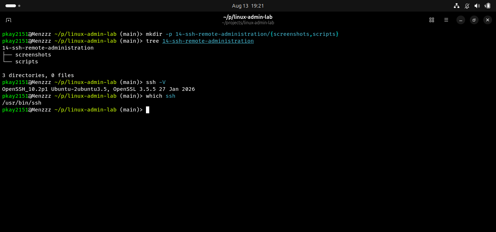
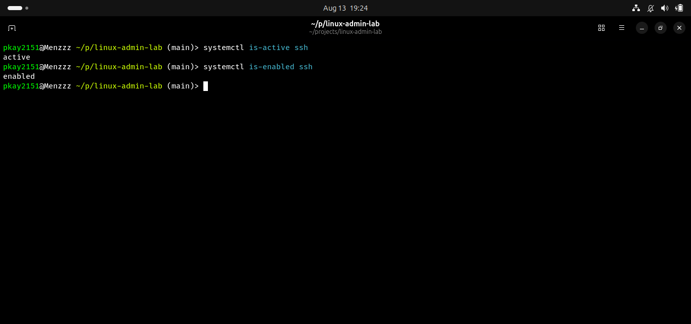
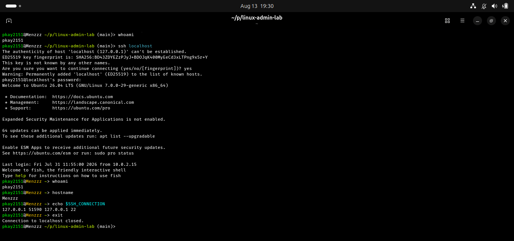
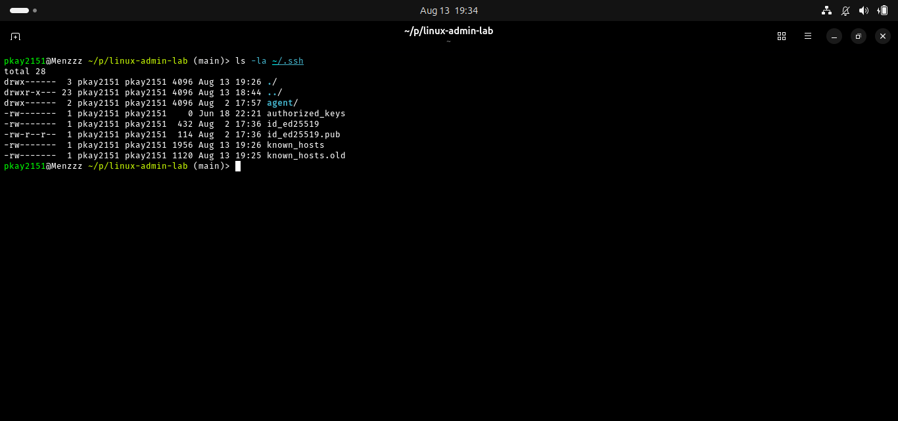
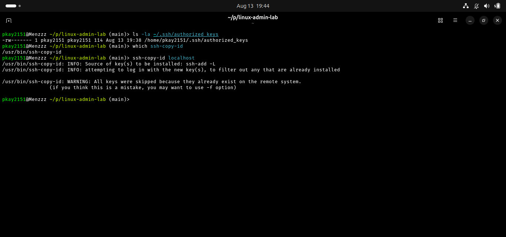
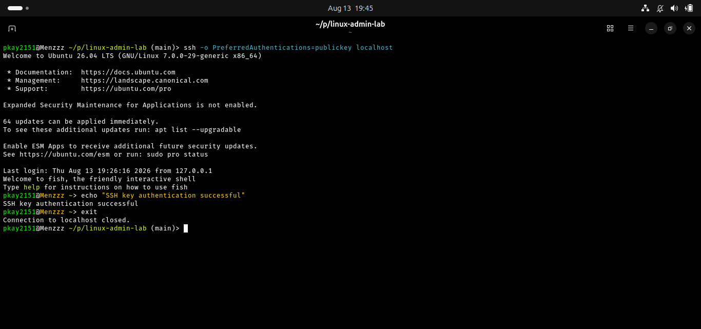
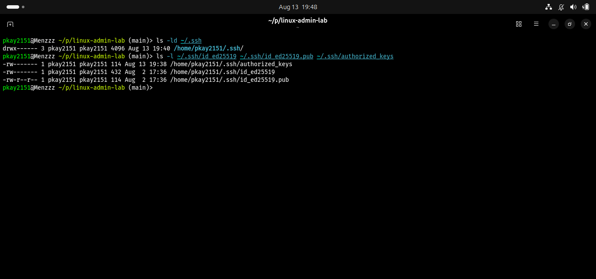
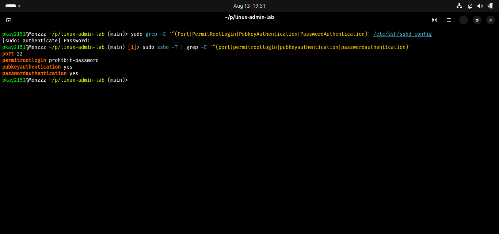
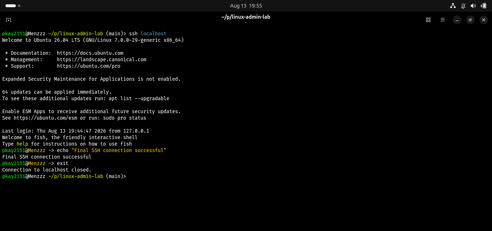

# SSH and Remote Administration in Linux

## Objective

The objective of this lab was to learn how Linux administrators use Secure Shell (SSH) for remote administration. The lab covered SSH client and server components, checking the SSH service, connecting to a local SSH server, public-key authentication, SSH key permissions, server configuration, and configuration validation.

## Real-World Scenario

Linux system administrators frequently manage servers remotely. SSH provides a secure way to access a remote Linux system, execute commands, transfer files, and administer services.

In this lab, the local Ubuntu system was used to simulate a remote server so that SSH administration concepts could be practiced safely.

## Environment

* Operating System: Ubuntu Linux
* Shell: Bash/Fish
* Version Control: Git and GitHub
* Remote Administration Protocol: SSH
* SSH Implementation: OpenSSH

## Commands and Concepts Practiced

| Command / Concept          | Purpose                                              |
| -------------------------- | ---------------------------------------------------- |
| `ssh -V`                   | Display the installed OpenSSH client version         |
| `which ssh`                | Locate the SSH client executable                     |
| `systemctl is-active ssh`  | Check whether the SSH server is running              |
| `systemctl is-enabled ssh` | Check whether SSH starts automatically at boot       |
| `ssh localhost`            | Connect to the local SSH server                      |
| `whoami`                   | Display the current user                             |
| `hostname`                 | Display the system hostname                          |
| `$SSH_CONNECTION`          | Display information about the current SSH connection |
| `ls -la ~/.ssh`            | Inspect SSH configuration and key files              |
| `ssh-copy-id`              | Install a public key on an SSH server                |
| `authorized_keys`          | Store authorized public SSH keys                     |
| `sshd -T`                  | Display the effective SSH server configuration       |
| `sshd -t`                  | Validate SSH server configuration syntax             |

## Tasks Completed

### 1. Verified the SSH Client

Commands:

```bash
ssh -V
which ssh
```

These commands were used to confirm that the OpenSSH client was installed and identify its executable location.

### 2. Checked the SSH Server

Commands:

```bash
systemctl is-active ssh
systemctl is-enabled ssh
```

These commands confirmed that the SSH server was running and configured to start automatically at boot.

### 3. Established an SSH Connection

Command:

```bash
ssh localhost
```

The local Ubuntu machine was used as the SSH server to safely simulate remote administration.

After connecting, the session was verified using:

```bash
whoami
hostname
echo $SSH_CONNECTION
```

### 4. Inspected SSH Key Files

Command:

```bash
ls -la ~/.ssh
```

The SSH directory was inspected to identify existing SSH keys and configuration files.

The private key was kept secure and was not exposed or committed to GitHub.

### 5. Installed a Public Key

Command:

```bash
ssh-copy-id localhost
```

The command reported that the public key already existed on the remote system. This confirmed that the key had previously been installed in the SSH server's authorized keys.

### 6. Tested Key-Based Authentication

Command:

```bash
ssh -o PreferredAuthentications=publickey localhost
```

The connection was successfully established using public-key authentication.

This demonstrated the difference between password-based authentication and SSH key-based authentication.

### 7. Checked SSH Key Permissions

Commands:

```bash
ls -ld ~/.ssh
ls -l ~/.ssh/id_ed25519 ~/.ssh/id_ed25519.pub ~/.ssh/authorized_keys
```

The permissions of the SSH directory, private key, public key, and `authorized_keys` file were inspected.

The private key was kept protected because it must never be exposed to other users or committed to a public repository.

### 8. Inspected SSH Server Configuration

Command:

```bash
sudo sshd -T | grep -E '^(port|permitrootlogin|pubkeyauthentication|passwordauthentication)'
```

This was used to inspect the effective SSH server configuration.

Important settings included the SSH port, root login policy, public-key authentication, and password authentication.

### 9. Validated SSH Configuration

Command:

```bash
sudo sshd -t
```

No output indicated that the SSH server configuration contained no syntax errors.

### 10. Performed a Final SSH Connection Test

The SSH connection was tested again using:

```bash
ssh localhost
```

The connection was successfully established, confirming that the SSH service and authentication configuration were functioning correctly.

## SSH Key Authentication

SSH key authentication uses a pair of cryptographic keys:

```text
Client
├── Private Key
└── Public Key
        |
        ↓
Server
└── ~/.ssh/authorized_keys
```

The private key remains on the client and must be kept secret. The public key can be installed on the server.

The server uses the public key to verify that the client possesses the corresponding private key.

## Security Practices

The following security practices were demonstrated:

* Protect private SSH keys.
* Never commit private keys to GitHub.
* Use public-key authentication where appropriate.
* Protect the `.ssh` directory and key files with appropriate permissions.
* Validate SSH configuration before restarting the SSH service.
* Avoid making SSH configuration changes without testing them first.
* Restrict direct root SSH access where appropriate.

## Screenshots

### SSH Client Installed



### SSH Server Status



### SSH Localhost Connection



### SSH Key Files



### SSH Public Key Installation



### SSH Key Authentication



### SSH Key Permissions



### SSH Server Configuration



### SSH Configuration Validation


### Final SSH Test


