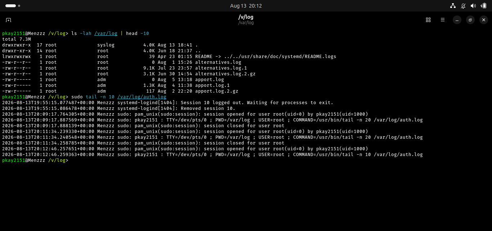
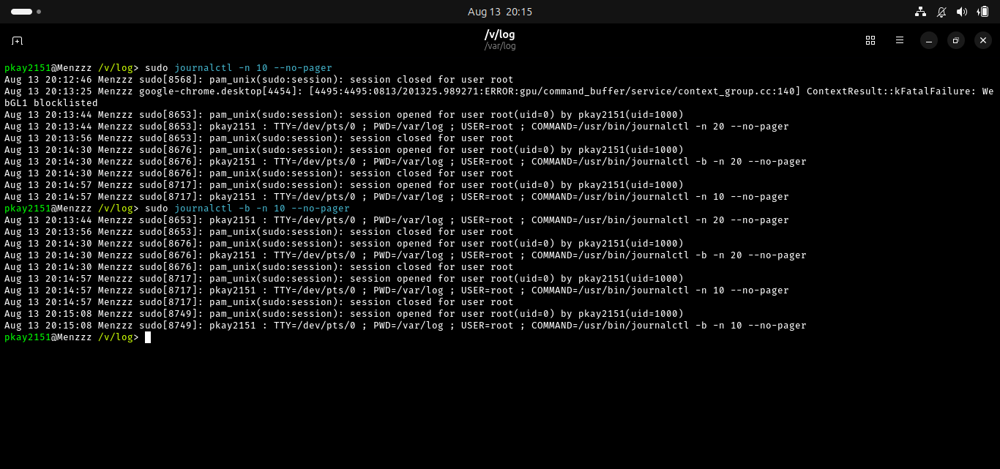
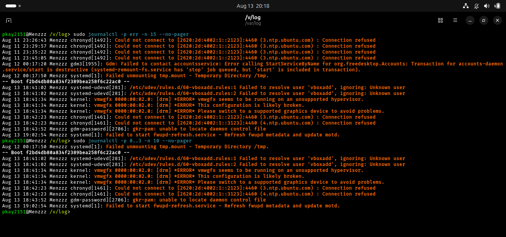
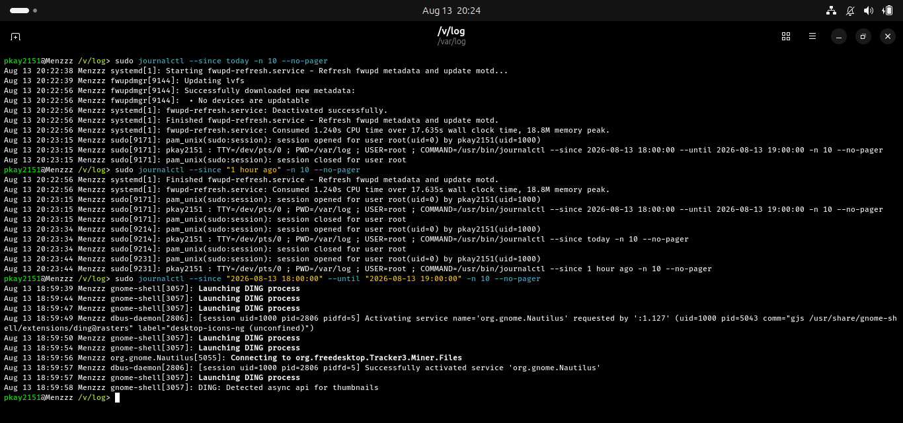
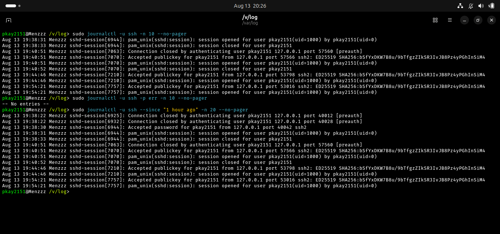
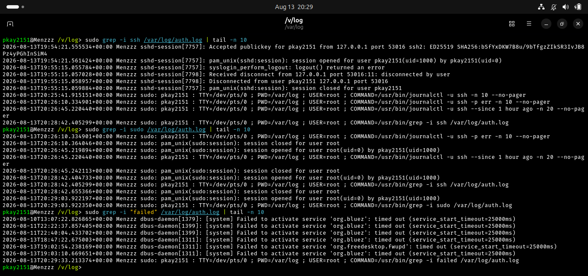
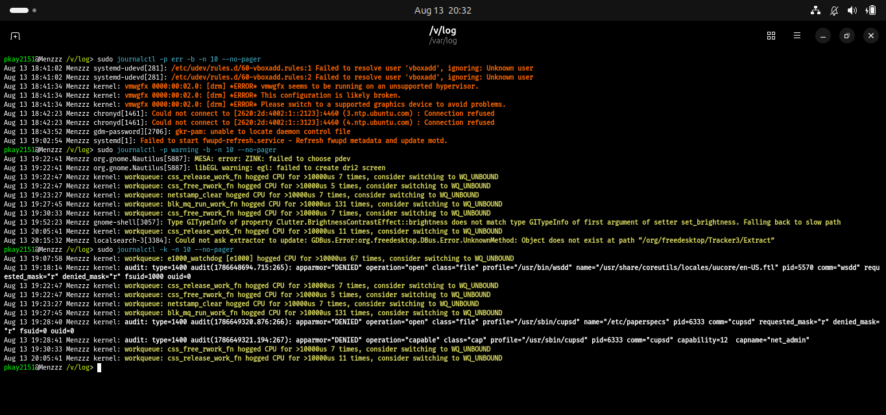
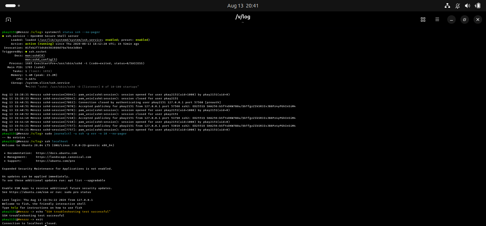
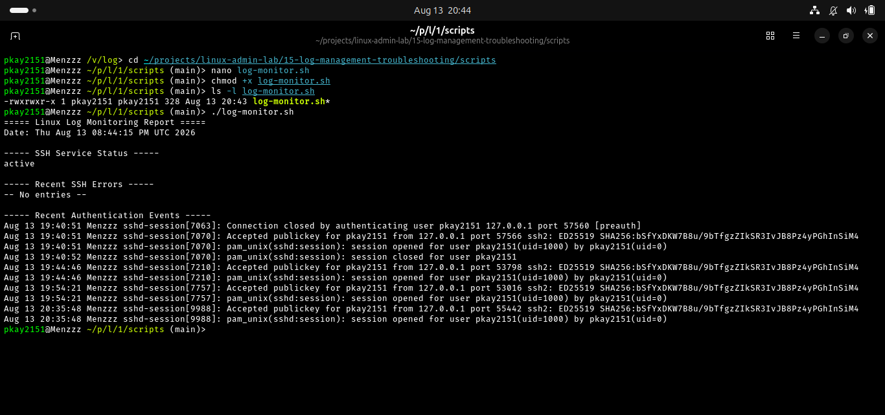

# Linux Log Management and Troubleshooting

## Objective

The objective of this lab was to learn how Linux administrators inspect, filter, and analyze system logs to troubleshoot system and service-related problems.

## Real-World Scenario

A Linux server is experiencing a problem with one of its services. As a Linux administrator, you need to investigate system logs, authentication events, service activity, and error messages to identify possible causes of the problem.

## Environment

- Operating System: Ubuntu Linux
- Shell: Bash/Fish
- Version Control: Git and GitHub

## Commands Practiced

| Command | Purpose |
|---------|---------|
| `ls -lah /var/log` | Display Linux log files |
| `tail` | View recent log entries |
| `journalctl` | View systemd journal logs |
| `grep` | Search logs for specific events |
| `systemctl status` | Check service status |
| `ssh localhost` | Test the SSH service |
| `chmod +x` | Make a script executable |

## Tasks Completed

### 1. Viewed System Logs

Command:

    ls -lah /var/log | head -15

Used to inspect the Linux system log directory and identify available log files.

### 2. Viewed Authentication Logs

Command:

    sudo tail -n 20 /var/log/auth.log

Used to view recent authentication and authorization events.

### 3. Viewed System Journal Logs

Command:

    sudo journalctl -n 20 --no-pager

Used to display recent systemd journal entries.

### 4. Viewed Logs from the Current Boot

Command:

    sudo journalctl -b -n 20 --no-pager

Used to view log entries generated during the current system boot.

### 5. Filtered Error Messages

Command:

    sudo journalctl -p err -n 20 --no-pager

Used to display error-level messages and more serious system events.

### 6. Filtered Logs by Time

Command:

    sudo journalctl --since "1 hour ago" -n 20 --no-pager

Used to view recent log entries from the previous hour.

A specific time range was also tested using:

    sudo journalctl --since "2026-08-13 18:00:00" --until "2026-08-13 19:00:00" -n 10 --no-pager

An earlier attempt using `today 18:00` produced a timestamp parsing error, so an explicit date and time were used.

### 7. Filtered Logs by Service

Command:

    sudo journalctl -u ssh -n 20 --no-pager

Used to view logs specifically generated by the SSH service.

SSH errors were also checked using:

    sudo journalctl -u ssh -p err -n 20 --no-pager

### 8. Searched Authentication Logs

Command:

    sudo grep -i ssh /var/log/auth.log | tail -n 20

Used to search for recent SSH-related authentication events.

The authentication log was also searched for `sudo` and failed authentication events:

    sudo grep -i sudo /var/log/auth.log | tail -n 20

    sudo grep -i "failed" /var/log/auth.log | tail -n 20

### 9. Checked System and Kernel Errors

Commands:

    sudo journalctl -p err -b -n 20 --no-pager

    sudo journalctl -k -n 20 --no-pager

Used to investigate system errors and kernel-related messages.

### 10. Troubleshot the SSH Service

Command:

    systemctl status ssh --no-pager

Used to check whether the SSH service was running.

The SSH service logs were then inspected using:

    sudo journalctl -u ssh -n 30 --no-pager

Finally, the SSH service was tested locally using:

    ssh localhost

### 11. Created a Log Monitoring Script

A Bash script was created at:

    scripts/log-monitor.sh

The script checks the SSH service status and displays recent SSH log information.

The script was made executable using:

    chmod +x scripts/log-monitor.sh

It was then executed using:

    ./scripts/log-monitor.sh

## Screenshots

### System and Authentication Logs

### Journal Logs

### Journal Error Filtering

### Time-Based Log Filtering

### SSH Log Filtering

### Authentication Log Analysis

### System Error Analysis

### SSH Service Troubleshooting

### Log Monitoring Script

