# Linux System Performance Monitoring

## Objective

The objective of this lab was to learn how Linux administrators monitor system performance, identify resource usage, and investigate CPU, memory, disk, process, and system resource activity.

## Real-World Scenario

A Linux server is becoming slow and users are experiencing delays. As a Linux administrator, you need to monitor system resources and identify whether CPU, memory, disk, or individual processes are responsible for the performance problem.

## Environment

- Operating System: Ubuntu Linux
- Shell: Bash/Fish
- Version Control: Git and GitHub

## Commands Practiced

| Command | Purpose |
|---------|---------|
| `top` | Monitor system performance and running processes |
| `free -h` | Display memory and swap usage |
| `uptime` | Display system uptime and load average |
| `ps aux` | Display running processes |
| `df -h` | Display filesystem disk usage |
| `du -sh` | Display directory disk usage |
| `vmstat` | Monitor system performance statistics |
| `lscpu` | Display CPU information |
| `nproc` | Display the number of available CPU cores |
| `cat /proc/pressure/*` | Check CPU, memory, and I/O pressure |

## Tasks Completed

### 1. Monitored CPU and Processes

Command:

    top

Used to monitor CPU usage, memory usage, load average, and running processes in real time.

### 2. Checked Memory Usage

Command:

    free -h

Used to view total, used, available, and swap memory.

### 3. Checked System Load

Command:

    uptime

Used to view system uptime, logged-in users, and the 1, 5, and 15-minute load averages.

### 4. Viewed Running Processes

Command:

    ps aux | head -15

Used to display information about currently running processes.

### 5. Checked Disk Usage

Command:

    df -h

Used to check filesystem capacity, used space, available space, and usage percentage.

### 6. Checked Directory Usage

Command:

    du -sh ~/* 2>/dev/null | sort -h

Used to identify the amount of disk space being used by directories in the home directory.

### 7. Monitored System Performance

Command:

    vmstat 1 5

Used to monitor processes, memory, swap, I/O, and CPU activity over several samples.

### 8. Checked CPU Information

Command:

    lscpu | head -15

Used to view important CPU and processor information.

### 9. Checked Available CPU Cores

Command:

    nproc

Used to determine the number of processing units available to the system.

### 10. Identified High CPU Processes

Command:

    ps aux --sort=-%cpu | head -10

Used to identify processes consuming the most CPU resources.

### 11. Identified High Memory Processes

Command:

    ps aux --sort=-%mem | head -10

Used to identify processes consuming the most memory resources.

### 12. Checked Resource Pressure

Commands:

    cat /proc/pressure/cpu
    cat /proc/pressure/memory
    cat /proc/pressure/io

Used to check CPU, memory, and I/O resource pressure on the system.

### 13. Viewed a Performance Summary

Command:

    top -b -n 1 | head -20

Used to capture a one-time snapshot of system performance information.

## Screenshots

### CPU and Process Monitoring

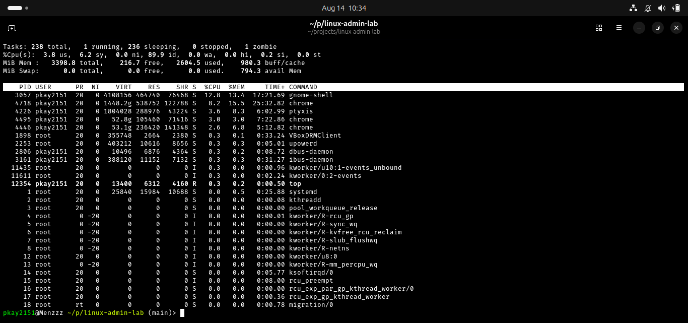

### Memory Usage

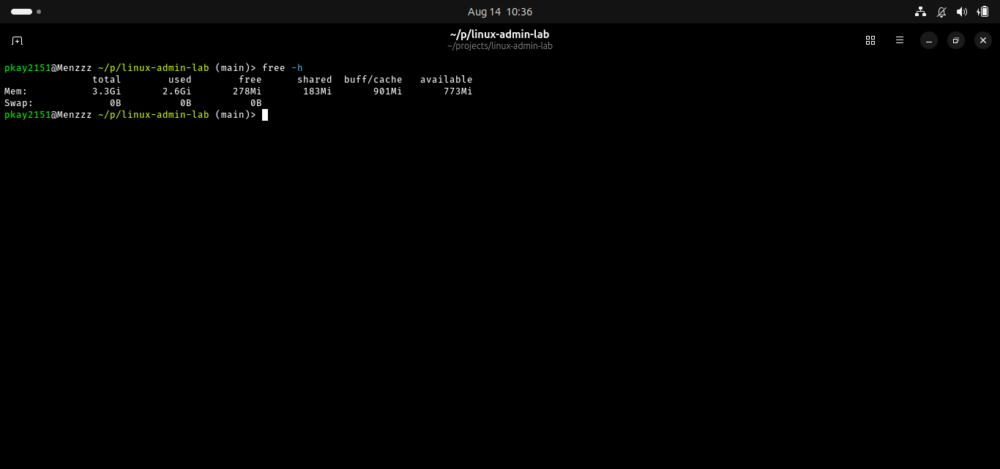

### System Load

### Process Monitoring

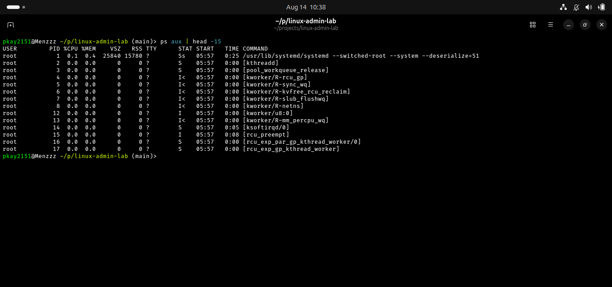

### Disk Usage

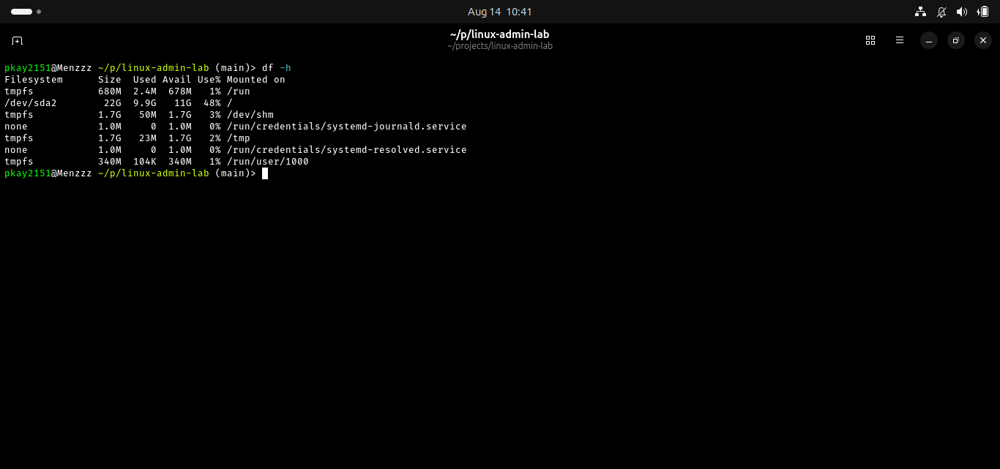

### Directory Usage

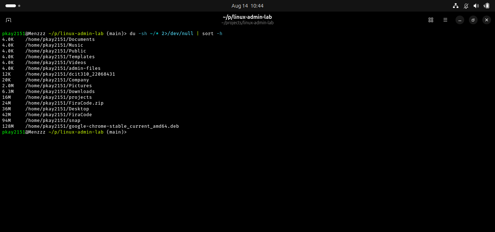

### VMStat Performance

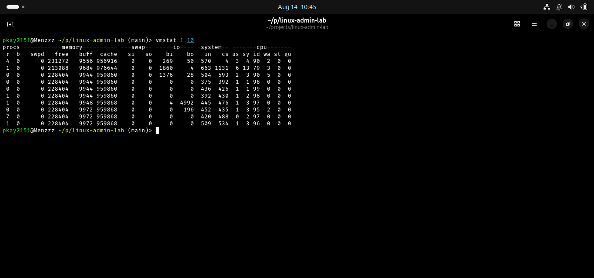

### CPU Information

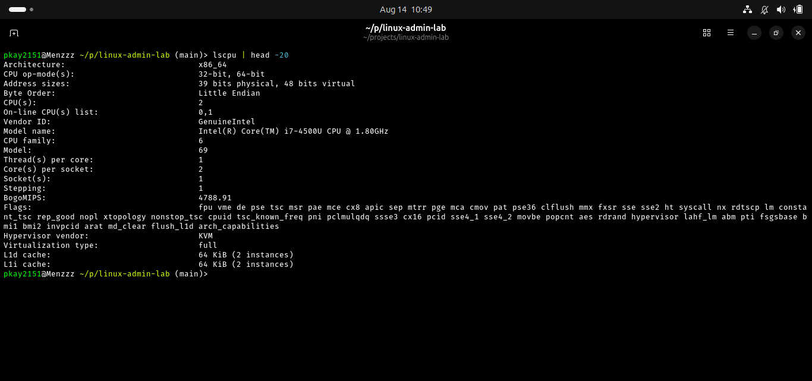

### CPU Cores

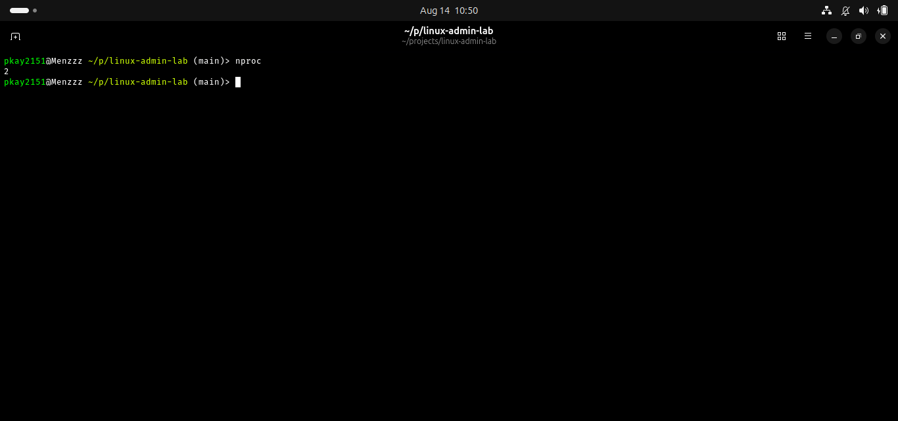

### Top CPU Processes

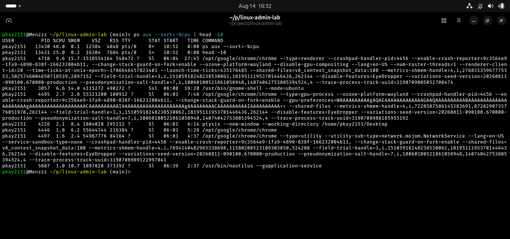

### Top Memory Processes

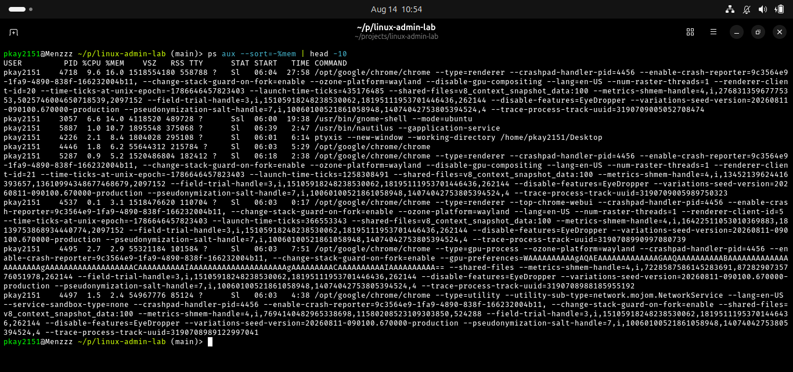

### Resource Pressure

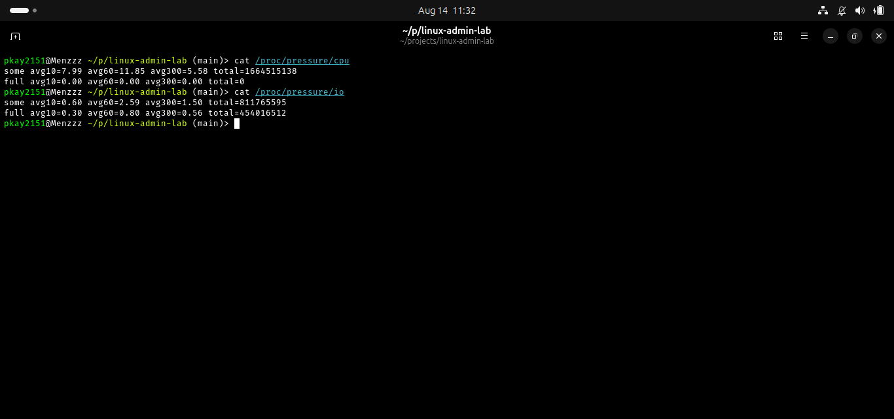

### Performance Summary

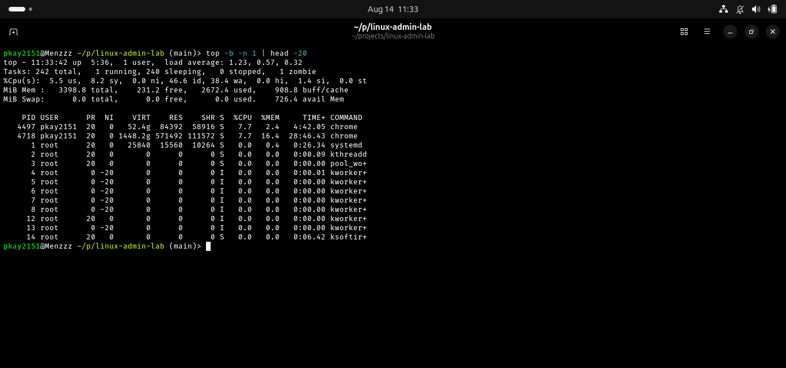

