# Linux Firewall Management

## Objective

The objective of this lab was to learn how Linux administrators configure, manage, and troubleshoot firewall rules using UFW (Uncomplicated Firewall).

## Real-World Scenario

A Linux server needs to control incoming network connections while allowing required services such as SSH and web traffic. As a Linux administrator, you need to configure firewall rules, verify allowed services, and safely manage firewall access.

## Environment

- Operating System: Ubuntu Linux
- Shell: Bash/Fish
- Firewall: UFW
- Version Control: Git and GitHub

## Commands Practiced

| Command | Purpose |
|---------|---------|
| `ufw status` | Display firewall status |
| `ufw status verbose` | Display detailed firewall configuration |
| `ufw status numbered` | Display numbered firewall rules |
| `ufw enable` | Enable the firewall |
| `ufw allow` | Allow network traffic |
| `ufw delete` | Remove a firewall rule |
| `ufw app list` | Display available application profiles |
| `ufw app info` | Display information about an application profile |

## Tasks Completed

### 1. Checked Firewall Status

Command:

    sudo ufw status verbose

Used to check whether UFW was active and view the current firewall configuration.

### 2. Inspected UFW Configuration

Command:

    sudo ufw show raw | head -30

Used to inspect the underlying UFW firewall configuration.

### 3. Checked UFW Installation and Version

Commands:

    which ufw

    ufw --version

Used to confirm that UFW was installed and identify its version.

### 4. Enabled the Firewall

Command:

    sudo ufw enable

Used to activate the UFW firewall.

### 5. Checked Default Firewall Policies

Command:

    sudo ufw status verbose

Used to verify the default incoming and outgoing firewall policies.

### 6. Allowed SSH Traffic

Command:

    sudo ufw allow ssh

Used to allow incoming SSH connections through the firewall.

### 7. Allowed HTTP Traffic

Command:

    sudo ufw allow http

Used to allow HTTP traffic on port 80.

### 8. Allowed HTTPS Traffic

Command:

    sudo ufw allow https

Used to allow secure HTTPS traffic on port 443.

### 9. Viewed Firewall Rules

Command:

    sudo ufw status numbered

Used to display configured firewall rules with rule numbers.

### 10. Checked UFW Application Profiles

Commands:

    sudo ufw app list

    sudo ufw app info OpenSSH

Used to view available UFW application profiles and inspect the OpenSSH profile.

### 11. Deleted a Firewall Rule

Command:

    sudo ufw delete <rule-number>

Used to safely remove a firewall rule by its rule number.

The HTTP rule was removed as a practical demonstration of firewall rule management.

### 12. Restored the HTTP Rule

Command:

    sudo ufw allow http

Used to restore HTTP access after testing rule deletion.

### 13. Verified the Final Firewall Configuration

Commands:

    sudo ufw status verbose

    sudo ufw status numbered

Used to confirm that the firewall was active and the required SSH, HTTP, and HTTPS rules were configured.

## Screenshots

### UFW Status

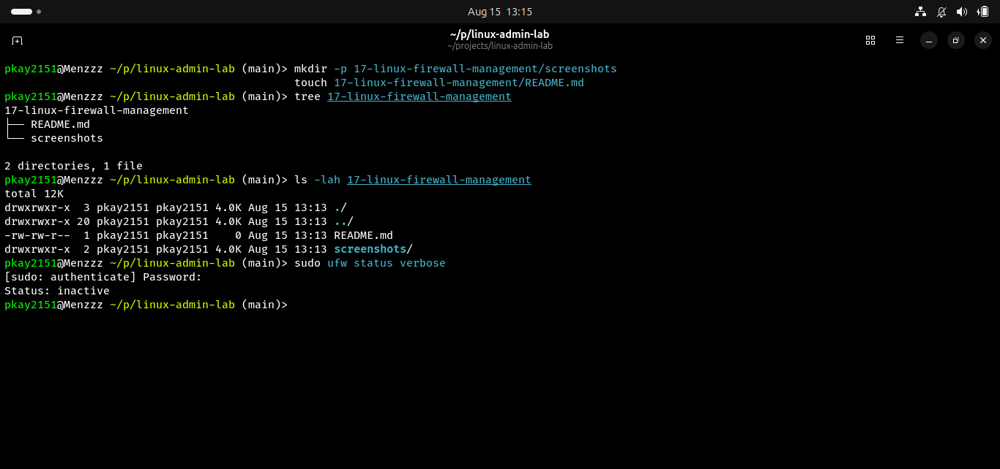

### UFW Configuration

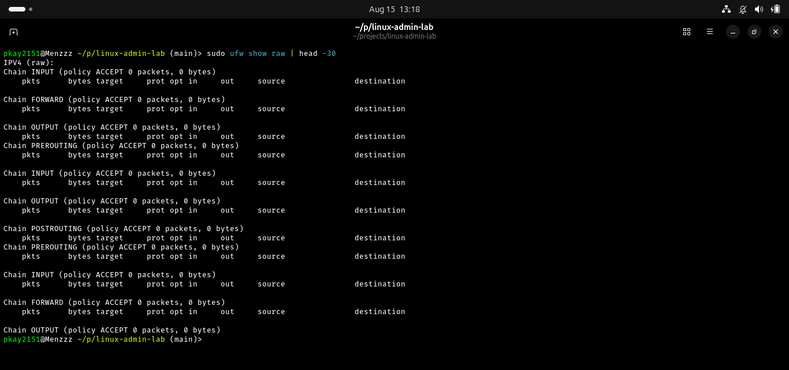

### UFW Version

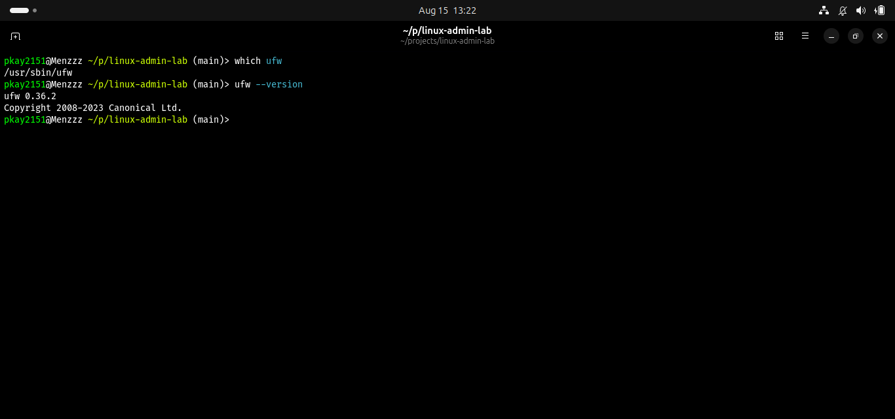

### UFW Enabled

### Default Firewall Policies

### SSH Rule

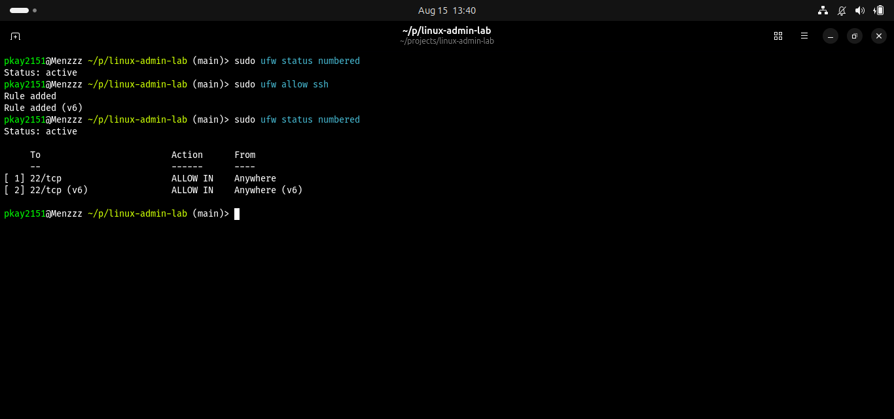

### HTTP Rule

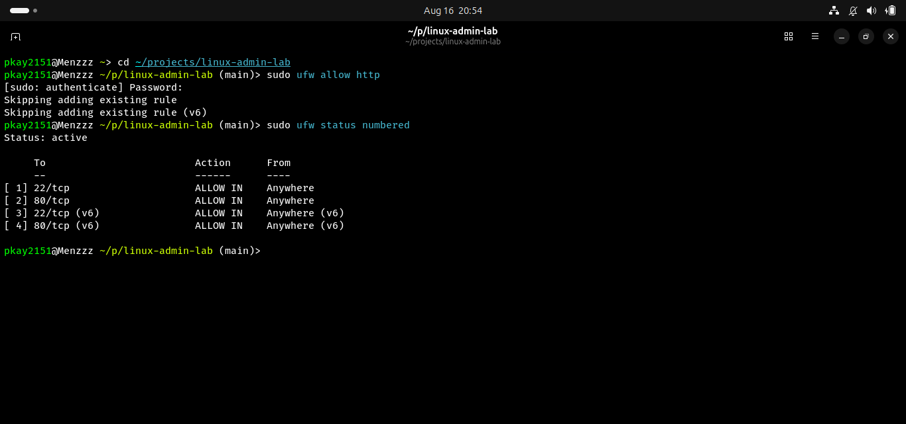

### Firewall Rules

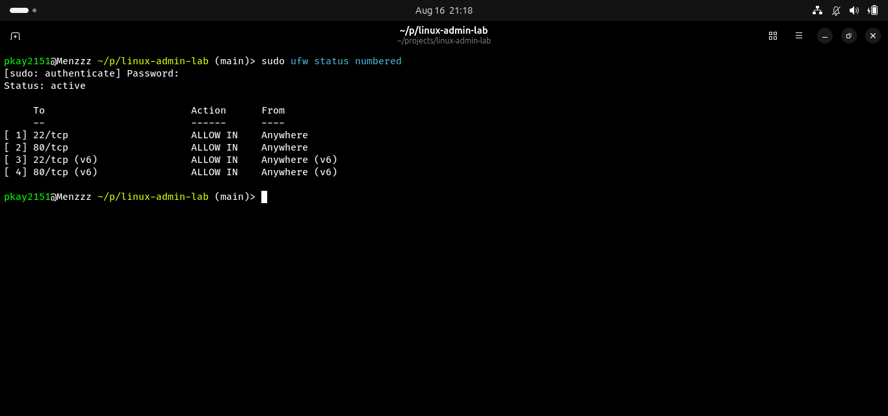

### HTTPS Rule

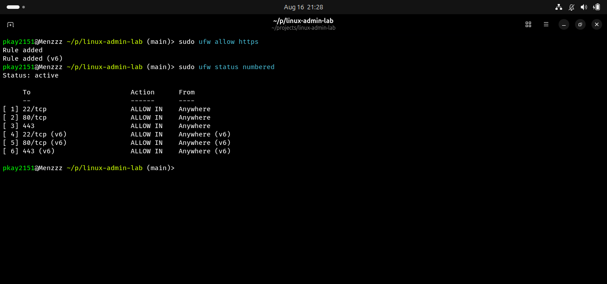

### Firewall Verification

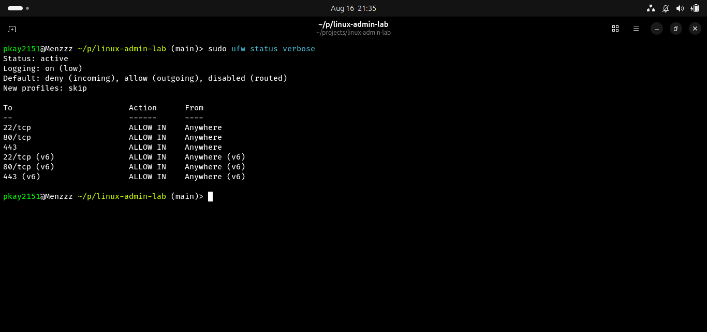

### UFW Application Profiles

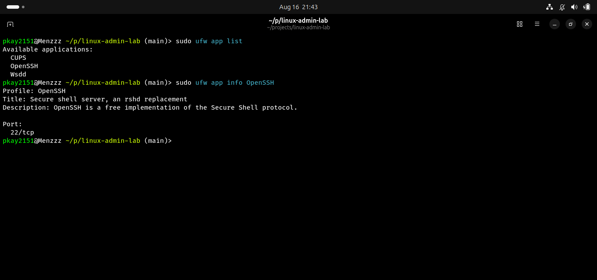

### Numbered Firewall Rules

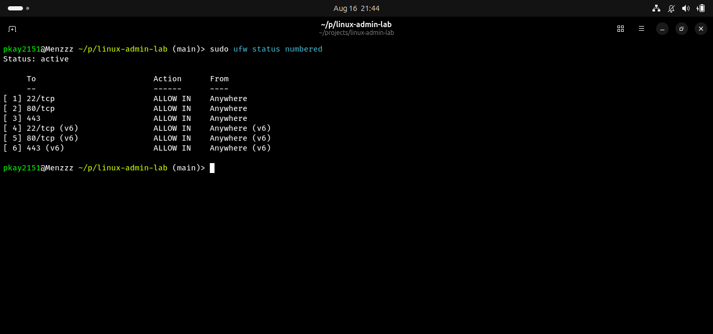

### Deleted Firewall Rule

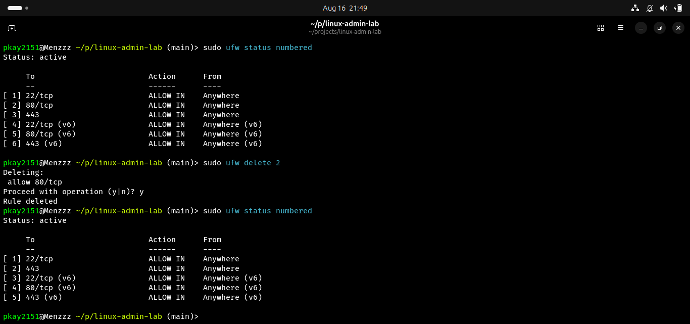

### Restored Firewall Rule

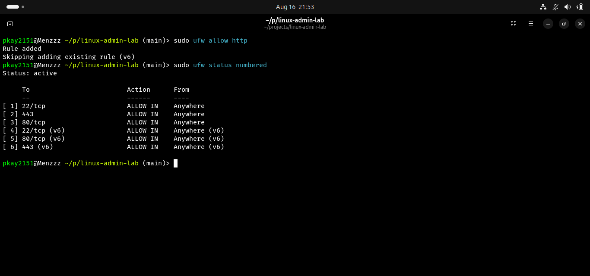

### Final Firewall Status

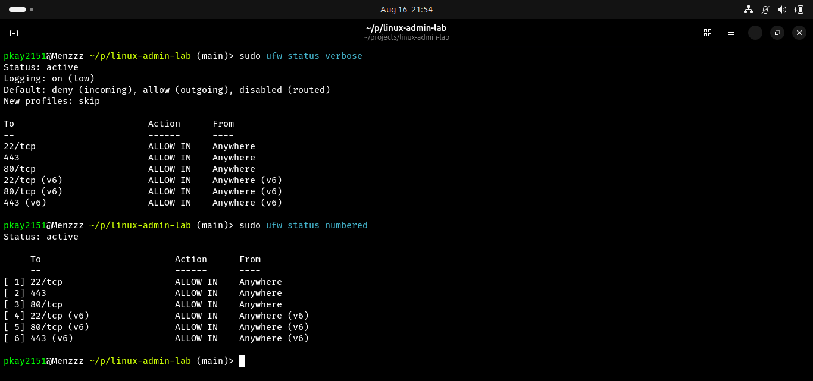
