# Linux Security Auditing

## Objective

The objective of this lab was to learn how Linux administrators perform basic security audits by inspecting users, permissions, authentication activity, network services, special file permissions, SSH configuration, and password policies.

## Real-World Scenario

A Linux server needs to be reviewed for potential security weaknesses. As a Linux administrator, you need to audit user accounts, privileged access, sensitive files, listening services, special permissions, SSH settings, and password policies to identify areas that may require attention.

## Environment

- Operating System: Ubuntu Linux
- Shell: Bash/Fish
- Version Control: Git and GitHub

## Commands Practiced

| Command | Purpose |
|---------|---------|
| `whoami` | Display the current user |
| `id` | Display user and group information |
| `cut` | Extract usernames from `/etc/passwd` |
| `getent group` | Display group membership |
| `ls -l` | Inspect file ownership and permissions |
| `journalctl` | Inspect system and authentication logs |
| `ss -tuln` | Display listening network services |
| `find` | Search for files with specific permissions |
| `sshd -T` | Display effective SSH configuration |
| `dpkg -l` | List installed packages |
| `chage -l` | Display password-aging information |

## Tasks Completed

### 1. Checked Current User Identity

Commands:

    whoami
    id

Used to identify the current user, UID, GID, and group memberships.

### 2. Audited User Accounts

Commands:

    cut -d: -f1 /etc/passwd | tail -15
    grep -E '/(bash|sh|fish)$' /etc/passwd

Used to inspect configured users and identify accounts with interactive login shells.

### 3. Checked Sudo Privileges

Commands:

    sudo getent group sudo
    sudo grep -vE '^\s*#|^\s*$' /etc/sudoers

Used to identify members of the sudo group and inspect active sudo configuration.

### 4. Checked Sensitive File Permissions

Command:

    ls -l /etc/passwd /etc/shadow /etc/group /etc/gshadow

Used to inspect ownership and permissions on important authentication files.

### 5. Audited Failed Authentication Attempts

Commands:

    sudo journalctl -u ssh --since "24 hours ago" | grep -i "failed"
    sudo journalctl --since "24 hours ago" | grep -Ei "authentication failure|failed password|invalid user" | tail -20

Used to search recent logs for failed authentication activity.

No matching failed authentication events were found during the audit period.

### 6. Checked Listening Network Services

Command:

    sudo ss -tuln

Used to identify TCP and UDP ports currently listening for network connections.

### 7. Checked World-Writable Files

Command:

    sudo find /etc /usr/local -type f -perm -0002 2>/dev/null | head -20

Used to identify files that can be modified by any local user.

### 8. Audited SUID Files

Command:

    sudo find /usr /bin /sbin -type f -perm -4000 2>/dev/null | head -10

Used to identify files with the SUID permission, which can execute with the permissions of their owner.

### 9. Audited SGID Files

Command:

    sudo find /usr /bin /sbin -type f -perm -2000 2>/dev/null | head -10

Used to identify files with the SGID permission, which can execute with the permissions of their assigned group.

### 10. Checked SSH Security Configuration

Command:

    sudo sshd -T | grep -E '^(permitrootlogin|passwordauthentication|pubkeyauthentication|port) '

Used to inspect the effective SSH security configuration.

### 11. Checked Security-Related Packages

Command:

    dpkg -l | grep -Ei 'ufw|openssh|fail2ban|auditd' | head -20

Used to identify installed firewall, SSH, intrusion-prevention, and auditing packages.

### 12. Checked Sudo Activity

Command:

    sudo journalctl --since "24 hours ago" | grep -i sudo | tail -20

Used to inspect recent activity involving administrative privileges.

### 13. Checked Password Policy

Command:

    grep -E '^(PASS_MAX_DAYS|PASS_MIN_DAYS|PASS_WARN_AGE)' /etc/login.defs

Used to inspect default password-aging policies.

### 14. Checked Account Password Aging

Command:

    sudo chage -l $(whoami)

Used to inspect password expiration and aging information for the current account.

### 15. Performed a Final Security Audit

Commands:

    sudo ufw status
    sudo ss -tuln | head -10
    whoami
    groups

Used to produce a final summary of firewall status, listening services, current user, and group membership.

## Screenshots

### User Identity

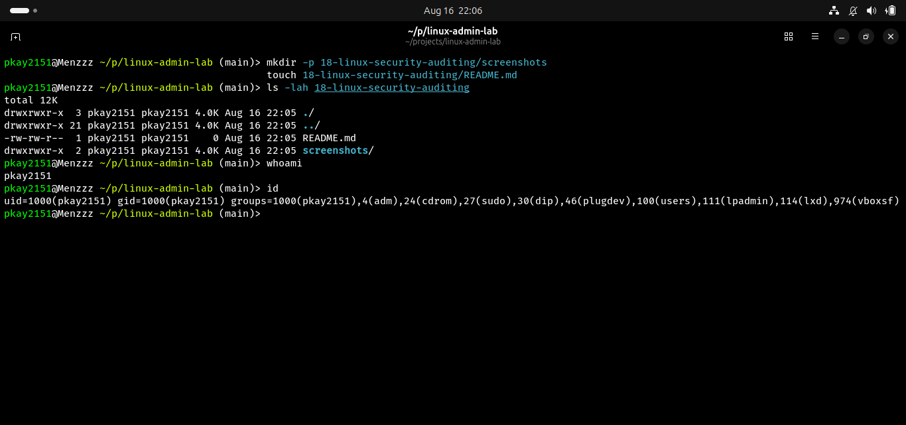

### User Account Audit

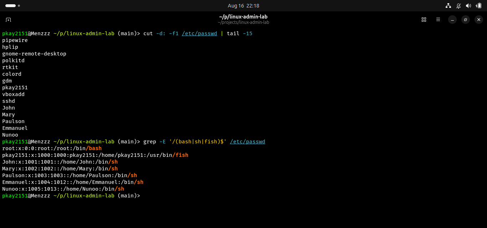

### Sudo Audit

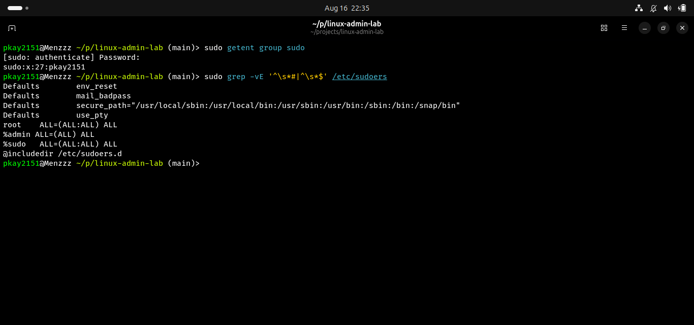

### Sensitive File Permissions

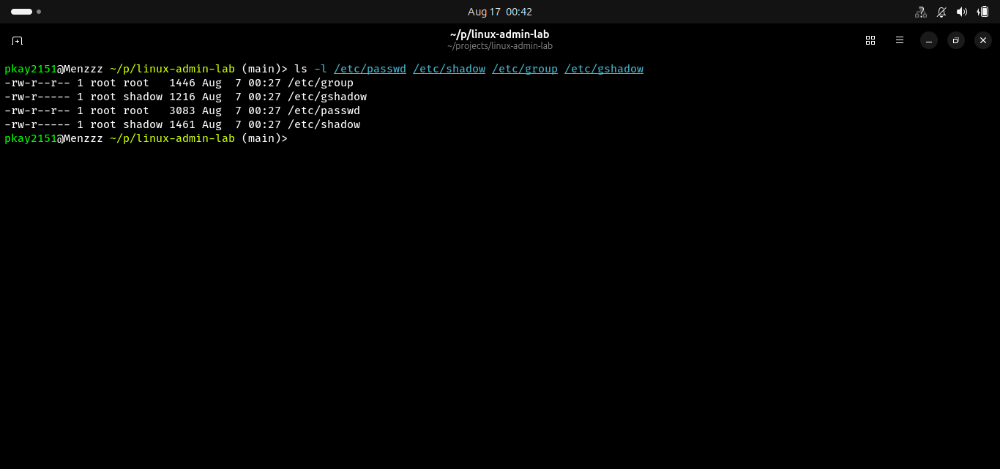

### Failed Authentication Audit

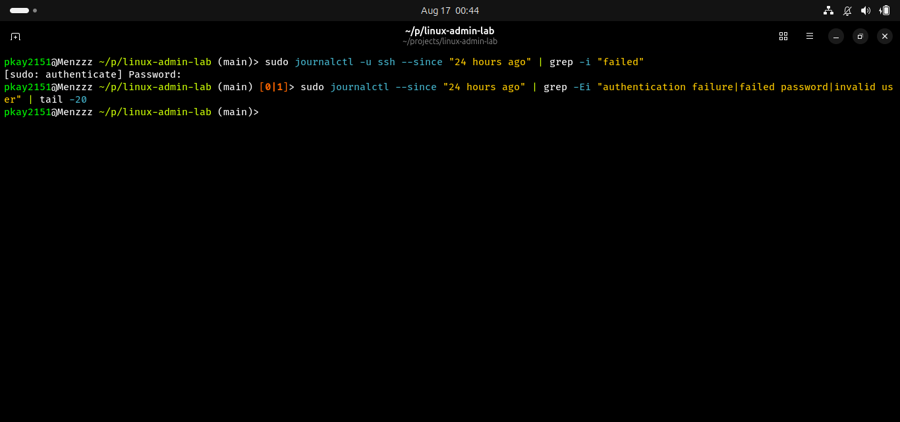

### Listening Services

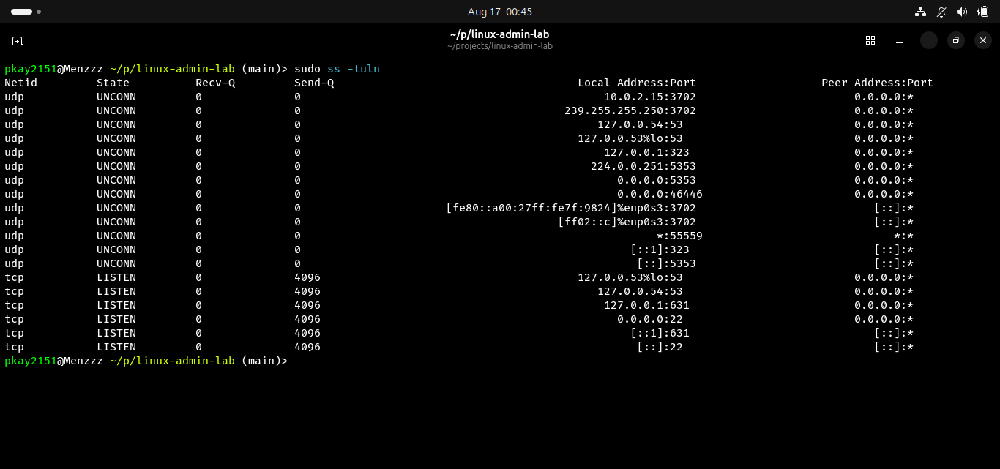

### World-Writable Files

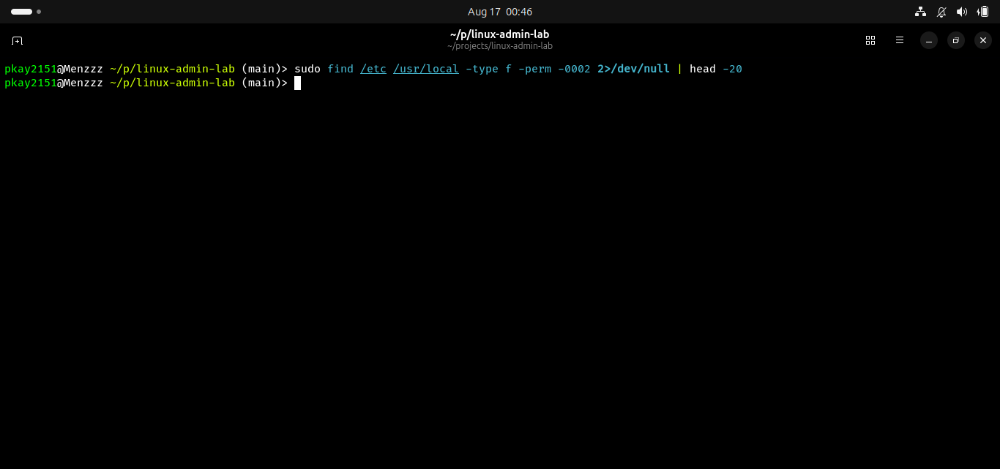

### SUID Files

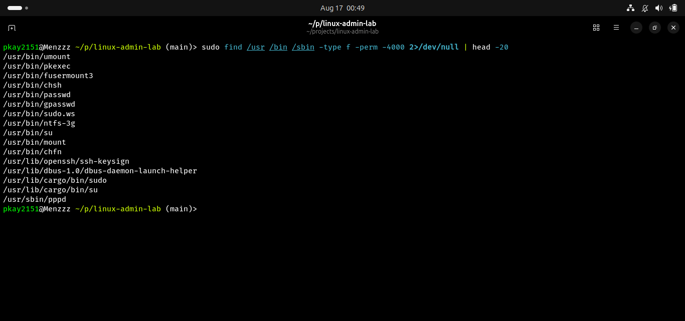

### SGID Files

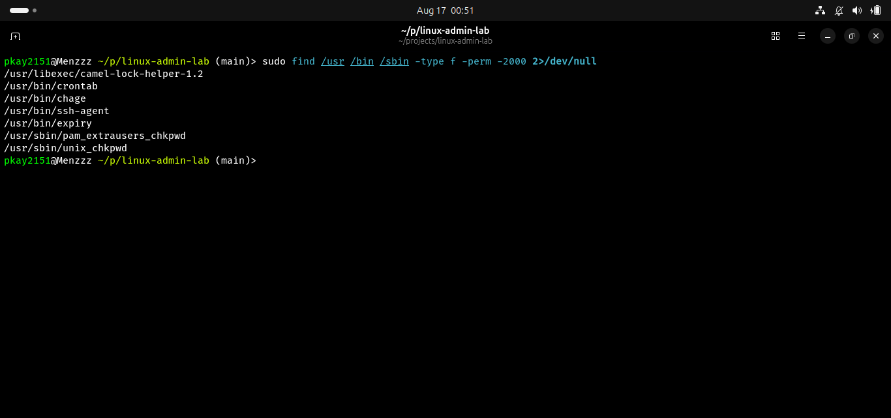

### SSH Security Configuration

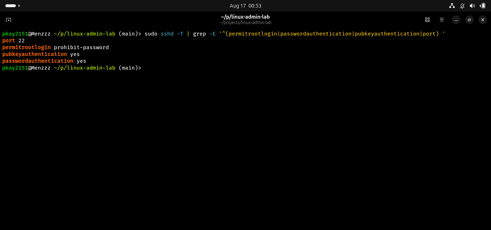

### Security Packages

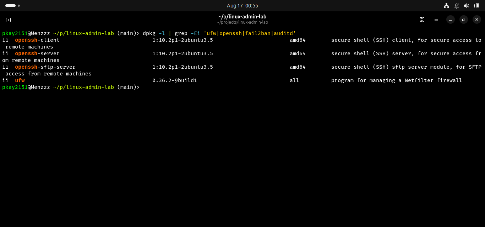

### Sudo Activity

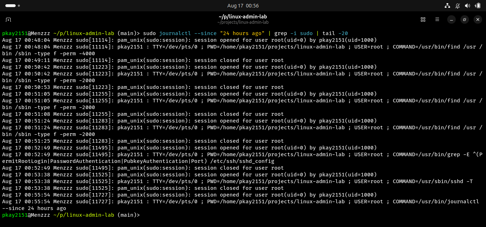

### Password Policy

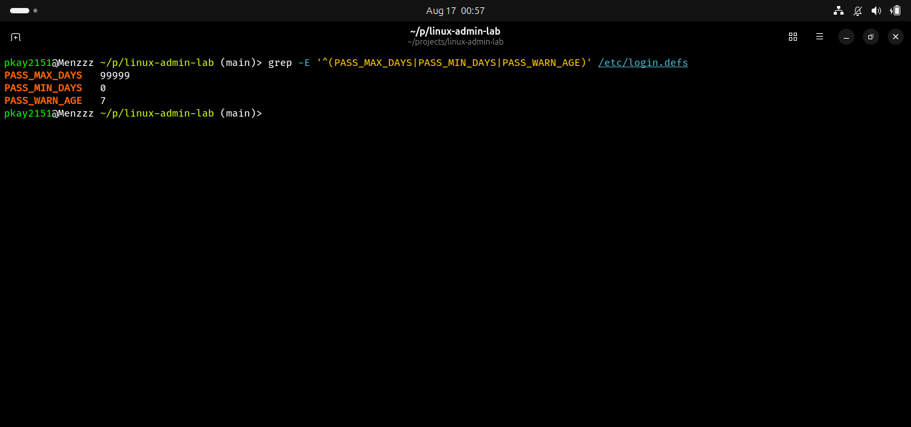

### Account Password Aging

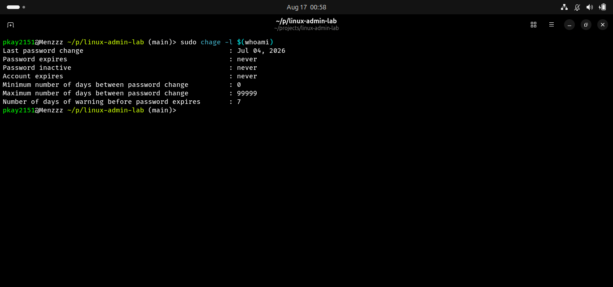

### Security Audit Summary

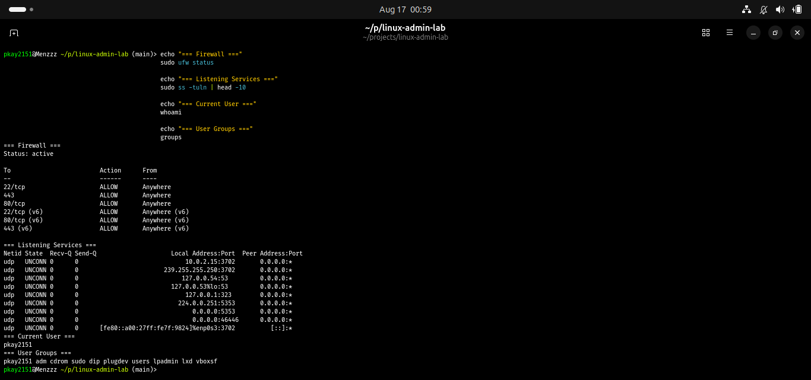

