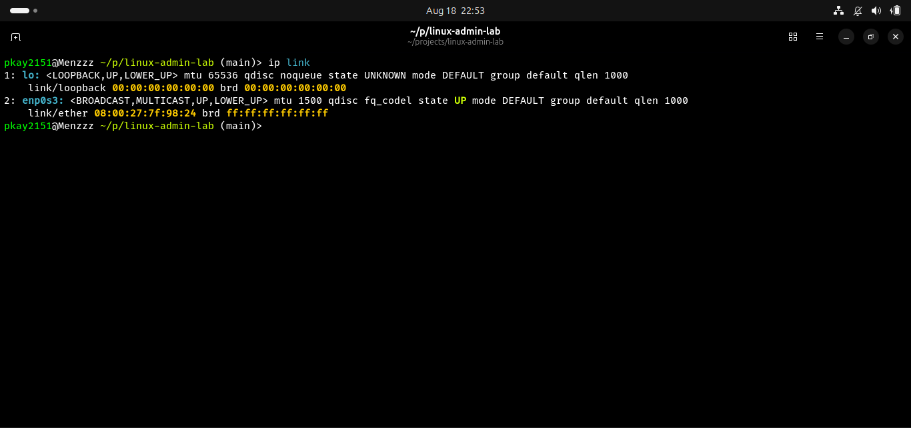
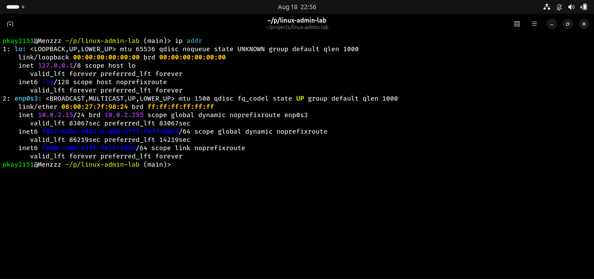
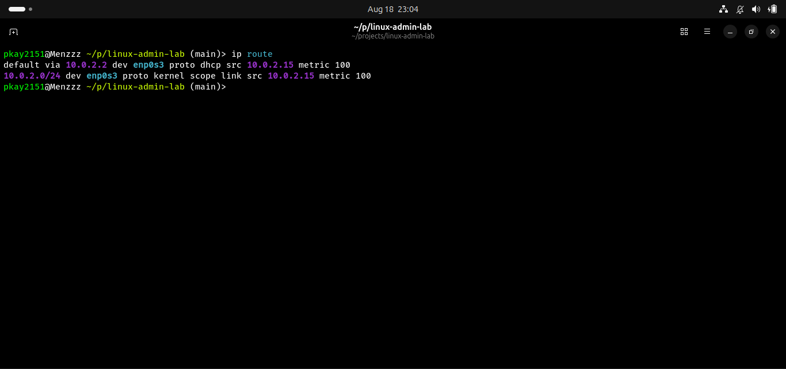
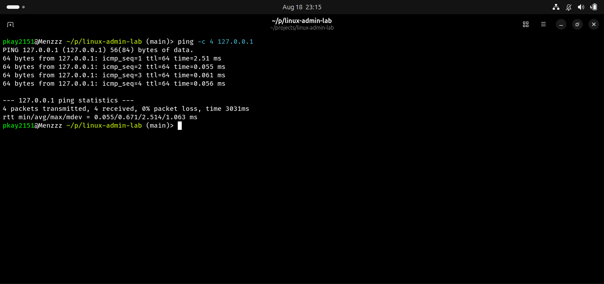
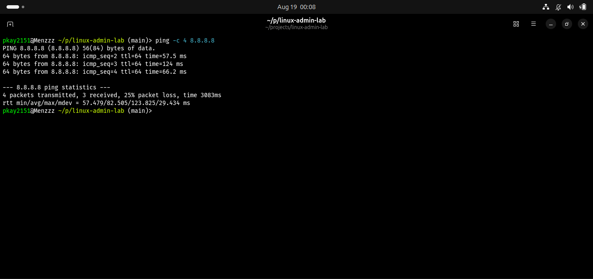
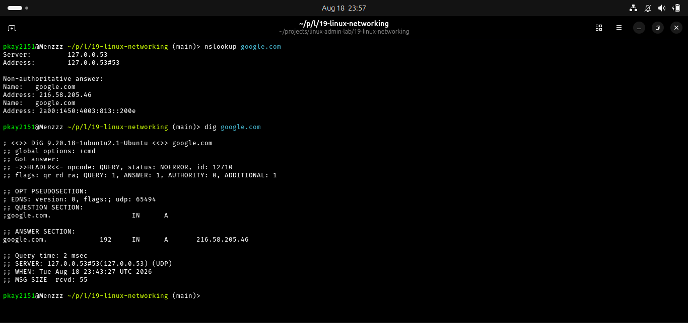
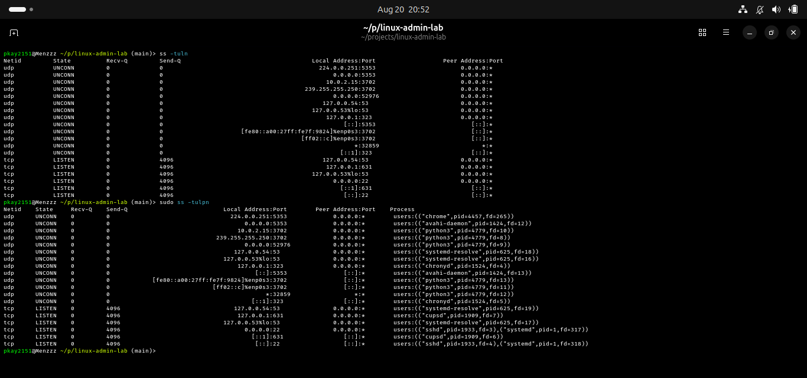
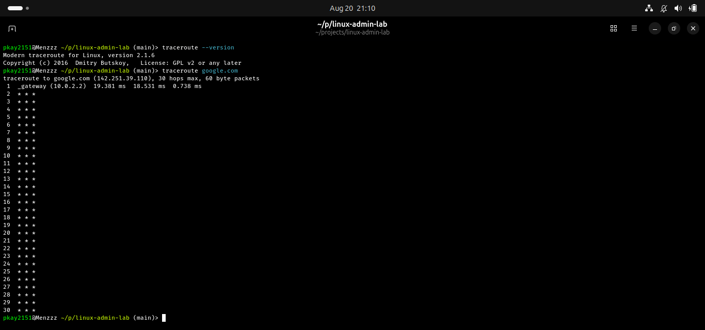

# Lab 19 — Linux Networking

## Objective

To understand and practice Linux networking fundamentals and use common networking tools to configure, inspect, test, and troubleshoot network connectivity.

---

## Task 1 — Network Interfaces

### Command Used

    ip link

### Description

The `ip link` command displays the network interfaces available on a Linux system.

Common interfaces include:

- `lo` — Loopback interface
- `eth0` — Ethernet interface
- `enp0s3` — Ethernet/virtual interface
- `wlan0` — Wireless interface

The `lo` interface is the loopback interface and is used for communication within the local machine.

### Screenshot

---

## Task 2 — IP Addressing

### Command Used

    ip addr

### Description

The `ip addr` command displays the IP addresses assigned to network interfaces.

IPv4 addresses use four decimal sections, for example:

    192.168.1.10

IPv6 addresses use hexadecimal notation, for example:

    2001:db8::1

An address may also contain a prefix length:

    192.168.1.10/24

The `/24` indicates the size of the network prefix.

### Screenshot

---

## Task 3 — Routing and Default Gateway

### Command Used

    ip route

### Description

The `ip route` command displays the Linux routing table.

The routing table determines where network packets should be sent.

A default route may look like:

    default via 192.168.1.1 dev enp0s3

This means traffic that does not have a more specific route is sent through `192.168.1.1`, using the `enp0s3` network interface.

The default gateway is normally the router that connects the local network to other networks or the Internet.

### Screenshot

---

## Task 4 — Loopback Connectivity

### Command Used

    ping -c 4 127.0.0.1

### Description

`127.0.0.1` is the standard IPv4 loopback address.

It refers to the local computer.

The `ping` command is used to test network connectivity, while `-c 4` tells it to send four packets.

### Screenshot

---

## Task 5 — External Network Connectivity

### Command Used

    ping -c 4 8.8.8.8

### Description

After testing communication with the local machine, I tested connectivity to an external IP address.

`8.8.8.8` is a public DNS server operated by Google and can also be used as an external connectivity test.

A simplified network path is:

    Linux Machine
          ↓
    Network Interface
          ↓
    Default Gateway
          ↓
    Router / ISP
          ↓
       Internet
          ↓
        8.8.8.8

### Screenshot

---

## Task 6 — DNS Resolution

### Commands Used

    nslookup google.com

    dig google.com

### Description

DNS stands for **Domain Name System**.

DNS translates human-readable domain names into IP addresses.

For example:

    google.com
         ↓
        DNS
         ↓
      IP Address

`nslookup` provides a simple way to query DNS.

`dig` provides more detailed DNS information and is commonly used by system administrators for DNS troubleshooting.

### Screenshot

---

## Task 7 — Network Ports and Listening Services

### Commands Used

    ss -tuln

    sudo ss -tulpn

### Description

A network port identifies a specific service or application running on a system.

For example:

    192.168.1.20:22

means:

    IP Address → 192.168.1.20
    Port       → 22
    Service    → SSH

Some commonly used ports are:

| Port | Service |
|------|---------|
| 22 | SSH |
| 53 | DNS |
| 80 | HTTP |
| 443 | HTTPS |
| 25 | SMTP |
| 3306 | MySQL |
| 5432 | PostgreSQL |

The options used with `ss` mean:

    -t → TCP
    -u → UDP
    -l → Listening
    -n → Numeric addresses and ports
    -p → Process information

### Screenshot

---

## Task 8 — Traceroute

### Installation

The `traceroute` command was not initially installed on my system.

I installed it using:

    sudo apt update

    sudo apt install traceroute

### Command Used

    traceroute google.com

### Description

`traceroute` is used to display the network path between the Linux system and a remote destination.

A simplified network path can look like:

    Linux Machine
          ↓
    Default Gateway
          ↓
      ISP Router
          ↓
    Internet Router
          ↓
    Internet Router
          ↓
      Destination

Each numbered line in the traceroute output represents a network hop.

Some hops may display:

    * * *

This does not necessarily mean that the network is broken. Some routers are configured not to respond to traceroute probes.

### Screenshot

---
